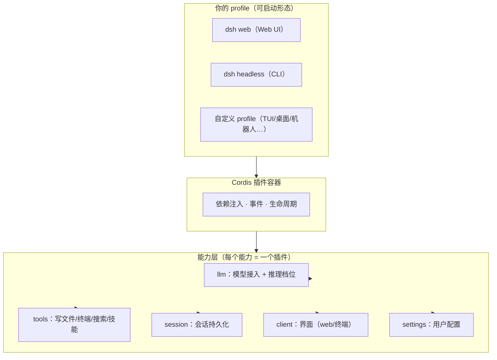
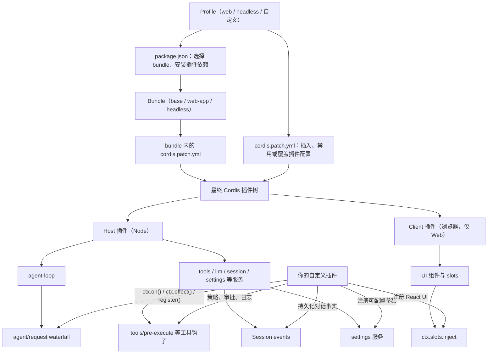

# DeepseekHarness源码阅读（一）


#### 分层视图
```
┌──────────────────────────────────────────────┐
│  你的 profile（可启动形态）                    │
│  = bundle 栈 + 你的补丁层                      │
│  · dsh web（Web UI 形态）                     │
│  · dsh headless（CLI 形态）                   │
│  · 你的自定义 profile（TUI/桌面/机器人…）      │
├──────────────────────────────────────────────┤
│  能力层（每个能力 = 一个插件）                 │
│  · llm：模型接入（DeepSeek V4 系 + 推理档位）   │
│  · tools：工具（写文件/终端/搜索/技能…）        │
│  · session：会话持久化                        │
│  · client：界面（web 浏览器半 / 终端半）        │
│  · settings：用户配置                         │
│  …（60+ 官方包）                              │
├──────────────────────────────────────────────┤
│  Cordis 插件容器：加载、依赖注入、事件、生命周期 │
└──────────────────────────────────────────────┘
```

##### Profile
一份“运行时装配方案”, 启动 dsh 时选择的一套插件清单和覆盖规则
- package.json：插件依赖 + 清单（dsh.profile.bundles 指定 bundle 顺序）
- cordis.patch.yml：你的补丁层（挂载/覆盖插件） 启动时按顺序合成：内置 bundle → profile patch → 全局 patch → --patch 覆盖。

##### Host/Client
- host 半在 Node 进程中运行。它注册 read_file、write_file 等工具，真的去读写磁盘；通常在 apply(ctx) 中注册服务、事件或工具。
- client 半在浏览器中运行。它把一次文件读取渲染成卡片、代码片段或 diff；它不能直接读你的磁盘，也不应接触 API Key。

##### 扩展点（extension point） 
官方原则："Plugins, not loop changes"——改行为优先用官方钩子，不要 fork 核心。常用扩展点（后续章节逐一实战）：
- agent/request waterfall：每次模型请求前改配置（工具调用提速插件的挂点）
- conversationEvents.register：订阅/注入对话事件
- ctx.slots.inject：在界面槽位注入 UI
- settings 服务：注册用户可配置项

##### Profile/Host/扩展点架构图


#### 手动集成插件
- 下载插件源码
``` bash
git clone https://github.com/omdsh-dev/DSH-better-sidebar.git
```
- 构建插件
```bash
cd /Users/zhoujie/Desktop/FortuneBuilding/DeepseekHarness/DSH-better-sidebar
pnpm install
pnpm build
```
- 确认产物存在
```bash
ls lib/index.js
```
- 为 web profile 添加本地链接依赖
```bash
cd ~/.dsh/profiles/web
```
编辑 `package.json`，在 dependencies 中添加插件路径
```bash
{
  "name": "dsh-profile-web",
  "private": true,
  "dependencies": {
   "dsh-better-sidebar": "link:/Users/zhoujie/Desktop/FortuneBuilding/DeepseekHarness/DSH-better-sidebar"
  },
  "dsh": {
    "profile": {
      "bundles": [
        "@deepseek-ai/dsh-base",
        "@deepseek-ai/dsh-web-app"
      ]
    }
  }
}
```
- 在 profile patch 中手动挂载插件
编辑 `cordis.patch.yml` 文件，若初始内容为
```bash
[]
```
则替换为
```bash
- insert:
    - id: better-sidebar
      name: dsh-better-sidebar
```
`cordis.patch.yml` 替换后内容：
```bash
# Your patch layer for this dsh profile, applied after every bundle layer:
# a top-level YAML array of loader patch entries (id-targeted config
# overrides, disables, and insert lists; `!!js` expressions allowed).
- insert:
    - id: better-sidebar
      name: dsh-better-sidebar
```
- 安装 profile 依赖
```bash
cd ~/.dsh/profiles/web
pnpm install
```

- 启动 web
```
cd /Users/zhoujie/Desktop/FortuneBuilding/DeepseekHarness/deepseek-harness
pnpm dsh web
```

- 修改插件后的重载流程
```bash
cd /Users/zhoujie/Desktop/FortuneBuilding/DeepseekHarness/DSH-better-sidebar
pnpm build

cd /Users/zhoujie/Desktop/FortuneBuilding/DeepseekHarness/deepseek-harness
pnpm dsh web
```

#### 命令速查
| 命令 | 用途 |
|---|---|
| `dsh web` | 启动 Web UI（等同于 `dsh --profile web`） |
| `dsh --profile headless "任务"` | 执行一次性任务，打印结果后退出 |
| `dsh plugin --profile <name> add <pkg>` | 为指定 profile 安装插件 |
| `dsh --dump-config` | 打印合成后的配置树 |
| `dsh --profile tui` | 以 TUI 模式运行（需预先安装 tui 插件，官方未内置） |
| `dsh --version` | 显示版本信息 |

#### 排障速查
| 现象 | 原因与解法 |
| -- | -- |
| dsh: profile "tui" does not exist | tui profile 需要由插件创建，例如：dsh plugin --profile tui add <pkg> |
| npx 极慢 | 首次下载包体较大；执行 npm i -g 全局安装后通常更快。 |
| 浏览器打不开 3080 | 端口可能被占用：Windows 可运行 netstat -ano | findstr 3080，再结束对应 PID。 |
| 模型无响应 | 检查 ~/.dsh/settings.yaml 的模型配置，以及 API Key 是否正确。 |
| 插件装不上（404） | 可能是 rc.1 依赖断裂；确认依赖是否使用 ^0.1.0-rc.6 版本线。 |
| 升级后行为变了 | RC 阶段可能存在破坏性变更；查看官方 changelog 和对应版本的迁移说明。 |


