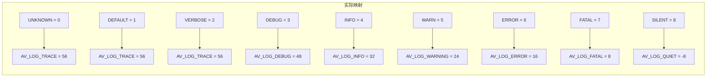
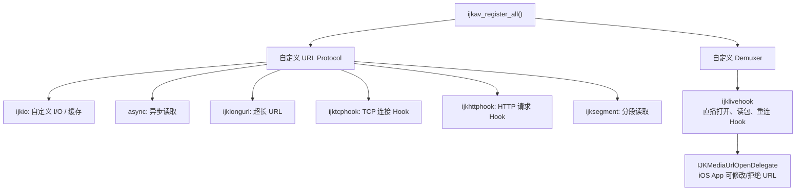
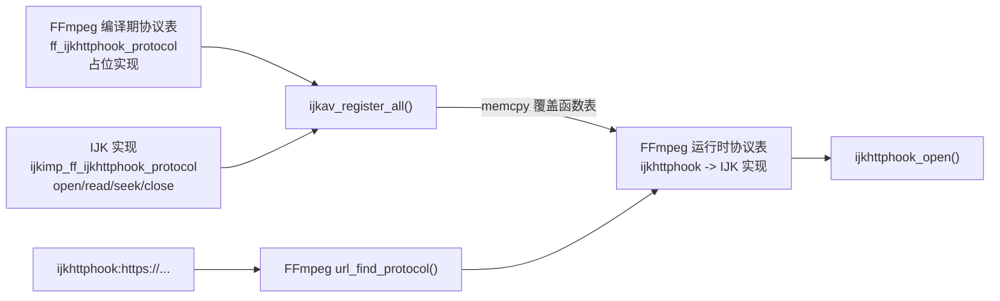
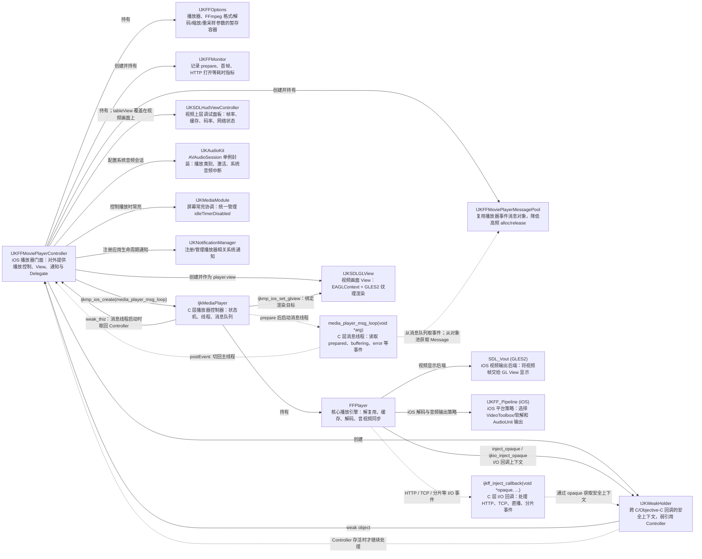

# IJKPlayer播放源码解析
## IJKPlayer播放代码
```objc
NSString *documentsPath = [NSSearchPathForDirectoriesInDomains(NSDocumentDirectory, NSUserDomainMask, YES) firstObject];

NSString *filePath =
[documentsPath stringByAppendingPathComponent:@"video.data"];
NSURL *url = [NSURL fileURLWithPath:filePath];

IJKFFOptions *options = [IJKFFOptions optionsByDefault];
[options setPlayerOptionIntValue:0 forKey:@"packet-buffering"];
[options setPlayerOptionIntValue:0 forKey:@"infbuf"];

[IJKFFMoviePlayerController setLogLevel:k_IJK_LOG_DEBUG];
IJKFFMoviePlayerController *player =
[[IJKFFMoviePlayerController alloc] initWithContentURL:url
                                           withOptions:options];

player.view.frame = self.view.bounds;
player.scalingMode = IJKMPMovieScalingModeAspectFit;
player.shouldAutoplay = YES;

[self.view addSubview:player.view];
[player prepareToPlay];

self.player = player; // 强引用，别忘了
```
---

## 内部逻辑解析
### IJKFFOptions配置源码解析
```objc
IJKFFOptions *options = [IJKFFOptions optionsByDefault];
```
这一句是在创建播放器的默认配置
```objc
+ (IJKFFOptions *)optionsByDefault
{
    IJKFFOptions *options = [[IJKFFOptions alloc] init];
    // 最大帧率是30fps，对超过 30fps 的视频，IJKPlayer 会按策略丢弃部分帧，避免高帧率视频造成过高 CPU/GPU 消耗。
    [options setPlayerOptionIntValue:30     forKey:@"max-fps"];
    // 不丢帧，关闭因解码或渲染跟不上而主动丢帧的策略。
    [options setPlayerOptionIntValue:0      forKey:@"framedrop"];
    // 视频已解码画面的队列容量为 3 帧
    [options setPlayerOptionIntValue:3      forKey:@"video-pictq-size"];
    // 禁用 iOS VideoToolbox 硬件视频解码，使用 FFmpeg 软件解码路径
    [options setPlayerOptionIntValue:0      forKey:@"videotoolbox"];
    // 当启用 videotoolbox 时，限制硬件解码的最大画面宽度为 960 像素
    [options setPlayerOptionIntValue:960    forKey:@"videotoolbox-max-frame-width"];

    // FFmpeg 格式层选项。关闭某些输入格式的自动码流转换，典型场景是 Annex B / MP4 AVC 等格式转换。
    [options setFormatOptionIntValue:0                  forKey:@"auto_convert"];
    // 对支持该选项的网络协议，读取中断后尝试重连。
    [options setFormatOptionIntValue:1                  forKey:@"reconnect"];
    // 网络 I/O 超时，单位是微秒，即 30 秒。连接、读取等操作超时会失败。源码对 RTMP、RTSP 会主动移除此项，因为它们对 timeout 的语义不同。
    [options setFormatOptionIntValue:30 * 1000 * 1000   forKey:@"timeout"];
    // HTTP 请求的 User-Agent 请求头，服务端可用它做识别、日志或策略控制。
    [options setFormatOptionValue:@"ijkplayer"          forKey:@"user-agent"];
    // 不显示 IJKPlayer 自带的 HUD 调试面板。该面板可展示 FPS、缓冲、码率、解码器等实时信息。
    options.showHudView   = NO;

    return options;
}
```
此处需要注意的是设置参数时使用了两个方法来保存
`setPlayerOptionIntValue` 和 `setFormatOptionValue`
他们根据功能将不同的参数保存在了 `IJKFFOptions` 内部不同的 NSDictionary 中
`IJKFFOptions` 内部总共有5个NSDictionary
```objc
// IJKPlayer 自己定义的播放控制项
NSMutableDictionary *_playerOptions;
// FFmpeg 输入格式、解封装、网络协议选项
NSMutableDictionary *_formatOptions;
// FFmpeg 音视频编解码器选项
NSMutableDictionary *_codecOptions;
// FFmpeg 图像缩放与像素格式转换选项
NSMutableDictionary *_swsOptions;
// FFmpeg 音频重采样选项
NSMutableDictionary *_swrOptions;
```
其持有关系如下图所示


`setPlayerOptionIntValue`  就存在 `_playerOptions` 中，`setFormatOptionValue` 就存在 `_formatOptions` 中，按照命名依次类推
还剩余外部赋值的两个options，其含义如下
```objc
// 是否启用“缺包后暂停播放，缓存到水位后再恢复”这一套水位驱动的缓冲状态机的开关
[options setPlayerOptionIntValue:0 forKey:@"packet-buffering"];
// 关闭无限缓冲
[options setPlayerOptionIntValue:0 forKey:@"infbuf"];
```

### IJKFFMoviePlayerController日志源码解析
```objc
// 设置日志等级为Debug
[IJKFFMoviePlayerController setLogLevel:k_IJK_LOG_DEBUG];
```
`IJKPlayer` 定义了一套自己的日志等级，数值越大，允许输出的日志越少
```objc
typedef enum IJKLogLevel {
    // 未知等级
    k_IJK_LOG_UNKNOWN = 0,
    // 默认等级
    k_IJK_LOG_DEFAULT = 1,
    // 最详细日志
    k_IJK_LOG_VERBOSE = 2,
    // 调试日志
    k_IJK_LOG_DEBUG   = 3,
    // 正常运行信息
    k_IJK_LOG_INFO    = 4,
    // 可恢复或非致命异常
    k_IJK_LOG_WARN    = 5,
    // 播放失败或严重异常
    k_IJK_LOG_ERROR   = 6,
    // 无法继续运行的错误
    k_IJK_LOG_FATAL   = 7,
    // 静默
    k_IJK_LOG_SILENT  = 8,
} IJKLogLevel;
```
setLogLevel 函数内部再根据 `log_level_ijk_to_av` 将 `IJKLogLevel` 日志等级转换成 `AV_LOG_LEVEL`，并设置给FFmpeg
```c++
inline static int log_level_ijk_to_av(int ijk_level)
{
    int av_level = IJK_LOG_VERBOSE;
    if      (ijk_level >= IJK_LOG_SILENT)   av_level = AV_LOG_QUIET;
    else if (ijk_level >= IJK_LOG_FATAL)    av_level = AV_LOG_FATAL;
    else if (ijk_level >= IJK_LOG_ERROR)    av_level = AV_LOG_ERROR;
    else if (ijk_level >= IJK_LOG_WARN)     av_level = AV_LOG_WARNING;
    else if (ijk_level >= IJK_LOG_INFO)     av_level = AV_LOG_INFO;
    // AV_LOG_VERBOSE means detailed info
    else if (ijk_level >= IJK_LOG_DEBUG)    av_level = AV_LOG_DEBUG;
    else if (ijk_level >= IJK_LOG_VERBOSE)  av_level = AV_LOG_TRACE;
    else if (ijk_level >= IJK_LOG_DEFAULT)  av_level = AV_LOG_TRACE;
    else if (ijk_level >= IJK_LOG_UNKNOWN)  av_level = AV_LOG_TRACE;
    else                                    av_level = AV_LOG_TRACE;
    return av_level;
}
```
最终映射关系如下


### IJKFFMoviePlayerController 播放器源码解析
```objc
IJKFFMoviePlayerController *player =
[[IJKFFMoviePlayerController alloc] initWithContentURL:url
                                           withOptions:options];

player.view.frame = self.view.bounds;
player.scalingMode = IJKMPMovieScalingModeAspectFit;
player.shouldAutoplay = YES;

[self.view addSubview:player.view];
[player prepareToPlay];

self.player = player; // 强引用，别忘了
```

#### initWithContentURL
此处调用 `initWithContentURL` 初始化一个 `IJKFFMoviePlayerController` player对象，
这个方法最终会透传到内部的方法`- (id)initWithContentURLString:(NSString *)aUrlString
                   withOptions:(IJKFFOptions *)options`，其内部也调用了大量初始化方法, 源码如下
```objc
- (id)initWithContentURLString:(NSString *)aUrlString
                   withOptions:(IJKFFOptions *)options
{
    if (aUrlString == nil)
        return nil;

    self = [super init];
    if (self) {
        // IJKPlayer 对 FFmpeg 的进程级一次性初始化
        ijkmp_global_init();

        // 建立 IJKPlayer C/FFmpeg 层到 Objective-C 层的统一事件出口。
        ijkmp_global_set_inject_callback(ijkff_inject_callback);

        // 当前运行时实际链接到的 FFmpeg 版本，是否正是 IJKPlayer 这份代码预期的版本。
        [IJKFFMoviePlayerController checkIfFFmpegVersionMatch:NO];

        // 兜底补充默认配置
        if (options == nil)
            options = [IJKFFOptions optionsByDefault];

        // IJKFFIOStatRegister(IJKFFIOStatDebugCallback);
        // IJKFFIOStatCompleteRegister(IJKFFIOStatCompleteDebugCallback);

        // 设置视频缩放模式
        _scalingMode = IJKMPMovieScalingModeAspectFit;
        // 自动播放
        _shouldAutoplay = YES;
        // 记录 async: 协议的环形缓冲区状态
        memset(&_asyncStat, 0, sizeof(_asyncStat));
        // 把 IJK 自定义缓存层的统计结构清零，由 ijkio 缓存协议产生
        memset(&_cacheStat, 0, sizeof(_cacheStat));
        // 保存媒体元信息与播放性能指标
        _monitor = [[IJKFFMonitor alloc] init];

        // 媒体 url
        _urlString = aUrlString;

        // 初始化内部 player
        _mediaPlayer = ijkmp_ios_create(media_player_msg_loop);
        // 创建的是播放器的消息对象池，用于复用 IJKFFMoviePlayerMessage 对象。
        _msgPool = [[IJKFFMoviePlayerMessagePool alloc] init];
        // IJKWeakHolder弱持有IJKFFMoviePlayerController，C 层回调需要
        IJKWeakHolder *weakHolder = [IJKWeakHolder new];
        weakHolder.object = self;

        // _mediaPlayer持有IJKFFMoviePlayerController对象，消息线程 media_player_msg_loop 启动后会
        ijkmp_set_weak_thiz(_mediaPlayer, (__bridge_retained void *) self);
        // ffplayer持有IJKWeakHolder对象，底层消息回调使用
        ijkmp_set_inject_opaque(_mediaPlayer, (__bridge_retained void *) weakHolder);
        // ffplayer持有IJKWeakHolder对象，但服务于 IJKIO 缓存层
        ijkmp_set_ijkio_inject_opaque(_mediaPlayer, (__bridge_retained void *)weakHolder);
        // 转换_shouldAutoplay值到 C 层的start-on-prepared
        ijkmp_set_option_int(_mediaPlayer, IJKMP_OPT_CATEGORY_PLAYER, "start-on-prepared", _shouldAutoplay ? 1 : 0);

        // 创建视频 view
        _glView = [[IJKSDLGLView alloc] initWithFrame:[[UIScreen mainScreen] bounds]];
        _glView.isThirdGLView = NO;
        _view = _glView;

        // 调试信息表格HUD
        _hudViewController = [[IJKSDLHudViewController alloc] init];
        [_hudViewController setRect:_glView.frame];
        _shouldShowHudView = NO;
        _hudViewController.tableView.hidden = YES;
        [_view addSubview:_hudViewController.tableView];

        // 在 HUD 中预注册/初始化相应字段，初始值为空。
        [self setHudValue:nil forKey:@"scheme"];
        [self setHudValue:nil forKey:@"host"];
        [self setHudValue:nil forKey:@"path"];
        [self setHudValue:nil forKey:@"ip"];
        [self setHudValue:nil forKey:@"tcp-info"];
        [self setHudValue:nil forKey:@"http"];
        [self setHudValue:nil forKey:@"tcp-spd"];
        [self setHudValue:nil forKey:@"t-prepared"];
        [self setHudValue:nil forKey:@"t-render"];
        [self setHudValue:nil forKey:@"t-preroll"];
        [self setHudValue:nil forKey:@"t-http-open"];
        [self setHudValue:nil forKey:@"t-http-seek"];
        
        self.shouldShowHudView = options.showHudView;

        // 绑定_glView到 vout
        ijkmp_ios_set_glview(_mediaPlayer, _glView);
        // 设置 C 层 FFPlayer.overlay_format = SDL_FCC__GLES2。
        ijkmp_set_option(_mediaPlayer, IJKMP_OPT_CATEGORY_PLAYER, "overlay-format", "fcc-_es2");
#ifdef DEBUG
        [IJKFFMoviePlayerController setLogLevel:k_IJK_LOG_DEBUG];
#else
        [IJKFFMoviePlayerController setLogLevel:k_IJK_LOG_SILENT];
#endif
        // 初始化音频
        [[IJKAudioKit sharedInstance] setupAudioSession];

        // 应用 options 到 player 上，player 内部也维持了与 optinos 内部一样的 NSDictionary 结构
        [options applyTo:_mediaPlayer];
        // App 进入后台时是否暂停播放
        _pauseInBackground = NO;

        // 设置“播放期间保持屏幕常亮”。
        _keepScreenOnWhilePlaying = YES;
        [self setScreenOn:YES];

        // 添加通知接收者
        _notificationManager = [[IJKNotificationManager alloc] init];
        [self registerApplicationObservers];
    }
    return self;
}
```

##### ijkmp_global_init（内部实现函数大部分在新版本上废弃，可忽略实现）
`ijkmp_global_init()` 是 IJKPlayer 对 FFmpeg 的进程级一次性初始化。它不是每个 IJKFFMoviePlayerController 都重新初始化一次，而是让编解码器、协议、网络、日志等全局设施只注册一次。
这个方法内部最终透传到 `ffp_global_init`
```objc
void ffp_global_init()
{
    // 静态变量，保证后续代码只初始化一次
    if (g_ffmpeg_global_inited)
        return;

    ALOGD("ijkmediaplayer version : %s", ijkmp_version());

    /*
    // FFmpeg <= 3.4      libavcodec <= 57   需要显式注册
    // FFmpeg 4.x          libavcodec 58      自动注册，旧 API 废弃
    // FFmpeg >= 5.0       libavcodec >= 59   旧 API 已删除
    // 向 FFmpeg 注册所有编解码器。例如 H.264、HEVC、AAC、MP3 的编码器/解码器，之后 FFmpeg 才能根据媒体流信息找到对应解码器。
    */
    avcodec_register_all();

    // 如果编译时启用了 libavdevice，注册音视频采集设备。
#if CONFIG_AVDEVICE
    avdevice_register_all();
#endif

    // 如果编译时启用了 libavfilter，注册所有音视频滤镜。
#if CONFIG_AVFILTER
    avfilter_register_all();
#endif

    /*
    注册 FFmpeg 的输入输出格式和协议实现。
    包括：
    容器/封装格式：MP4、FLV、MKV、TS、HLS 等。
    解封装器：从容器中分离音视频流。
    协议：file、http、https、rtmp、rtsp 等。
    之后 avformat_open_input() 才能根据 URL 或文件内容识别如何打开媒体。
    */
    av_register_all();

    // ijkav_register_all() 是 IJKPlayer 自己的“FFmpeg 扩展模块注册”入口。
    ijkav_register_all();

    // 是 FFmpeg 对网络协议模块的全局初始化。
    avformat_network_init();

    // 把 IJKPlayer 的 lockmgr 函数注册给旧版 FFmpeg，让 FFmpeg 在需要访问全局共享资源时，使用 IJK 提供的互斥锁实现。新版本已废弃
    av_lockmgr_register(lockmgr);

    // 把 FFmpeg 的全局日志输出回调替换成 IJKPlayer 自己的日志处理函数。
    av_log_set_callback(ffp_log_callback_brief);

    // 创建一个全局的“刷新哨兵包”。
    av_init_packet(&flush_pkt);
    flush_pkt.data = (uint8_t *)&flush_pkt;

    // 初始化后修改值为true，保证ffp_global_init只初始化一次
    g_ffmpeg_global_inited = true;
}
```

###### ijkav_register_all
ijkav_register_all() 是 IJKPlayer 自己的“FFmpeg 扩展模块注册”入口。负责把 IJKPlayer 自己实现的协议、缓存、回调 Hook、长 URL 处理等能力接入 FFmpeg。

以注册 `ijkhttphook` 协议为例子
```c++
IJK_REGISTER_PROTOCOL(ijkhttphook);
```
IJK 修改过 FFmpeg 源码，在协议表中预先放入一个占位协议：
```c++
URLProtocol ff_ijkhttphook_protocol = {
    .name      = "ijkhttphook",
    .url_open2 = ijkdummy_open, // 初始仅返回 -1
};
```
IJKPlayer 自己则实现了一份完整协议回调表：
```c++
URLProtocol ijkimp_ff_ijkhttphook_protocol = {
    .name      = "ijkhttphook",
    .url_open2 = ijkhttphook_open,
    .url_read  = ijkhttphook_read,
    .url_seek  = ijkhttphook_seek,
    .url_close = ijkurlhook_close,
};
```
启动时，宏实际调用的注册函数做的是：
```c++
#define IJK_REGISTER_PROTOCOL(x)                                        \
    {                                                                   \
        extern URLProtocol ijkimp_ff_##x##_protocol;                        \
        int ijkav_register_##x##_protocol(URLProtocol *protocol, int protocol_size);\
        ijkav_register_##x##_protocol(&ijkimp_ff_##x##_protocol, sizeof(URLProtocol));  \
    }
```

```c++
// 源码在ijkplayer-ios/ios/ffmpeg-arm64/libavformat/ijkutils.c文件中
#define IJK_FF_PROTOCOL(x)                                                                          \
extern URLProtocol ff_##x##_protocol;                                                               \
int ijkav_register_##x##_protocol(URLProtocol *protocol, int protocol_size);                        \
int ijkav_register_##x##_protocol(URLProtocol *protocol, int protocol_size)                         \
{                                                                                                   \
    if (protocol_size != sizeof(URLProtocol)) {                                                     \
        av_log(NULL, AV_LOG_ERROR, "ijkav_register_##x##_protocol: ABI mismatch.\n");               \
        return -1;                                                                                  \
    }                                                                                               \
    memcpy(&ff_##x##_protocol, protocol, protocol_size);                                            \
    return 0;                                                                                       \
}
```
把 FFmpeg 协议表中原来的占位 URLProtocol 函数指针，替换成 IJK 的 open/read/seek/close 函数指针。

之后再打开 `ijkhttphook:https://cdn.example.com/video.mp4` 链接时，就能 hook 该url，走ijk内部实现的 `ijkhttphook_open` 等流程

##### ijkmp_ios_create
```c++
_mediaPlayer = ijkmp_ios_create(media_player_msg_loop);

IjkMediaPlayer *ijkmp_ios_create(int (*msg_loop)(void*))
{
    IjkMediaPlayer *mp = ijkmp_create(msg_loop);
    if (!mp)
        goto fail;

    mp->ffplayer->vout = SDL_VoutIos_CreateForGLES2();
    if (!mp->ffplayer->vout)
        goto fail;

    mp->ffplayer->pipeline = ffpipeline_create_from_ios(mp->ffplayer);
    if (!mp->ffplayer->pipeline)
        goto fail;

    return mp;

fail:
    ijkmp_dec_ref_p(&mp);
    return NULL;
}
```
创建一个带 iOS 音视频输出能力的底层播放器，并指定以后由 media_player_msg_loop 接收并转发底层播放事件。
_mediaPlayer 的类型是`IjkMediaPlayer`，它不负责具体的拉流，解码等逻辑，只是一层包含了各种状态的封装层，实际负责解码逻辑的是它的成员变量 `ffplayer`，它们之间的依赖关系为
```
IJKFFMoviePlayerController  (Objective-C 门面)
        │ 强持有
        ▼
IjkMediaPlayer              (C 层状态机)
        │ 持有
        ▼
FFPlayer                    (读包、缓冲、解码、同步核心)
        ├── SDL_VoutIos GLES2    视频输出
        └── IJKFF_Pipeline iOS  音视频平台适配
```
`media_player_msg_loop` 是消息回调，等 player 开始播放后，创建名为 ff_msg_loop 的消息线程，然后在线程中调用这个回调。

##### initWithContentURL类依赖关系图

