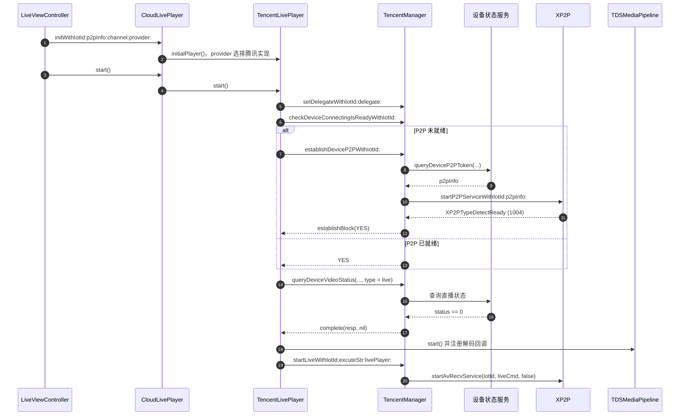
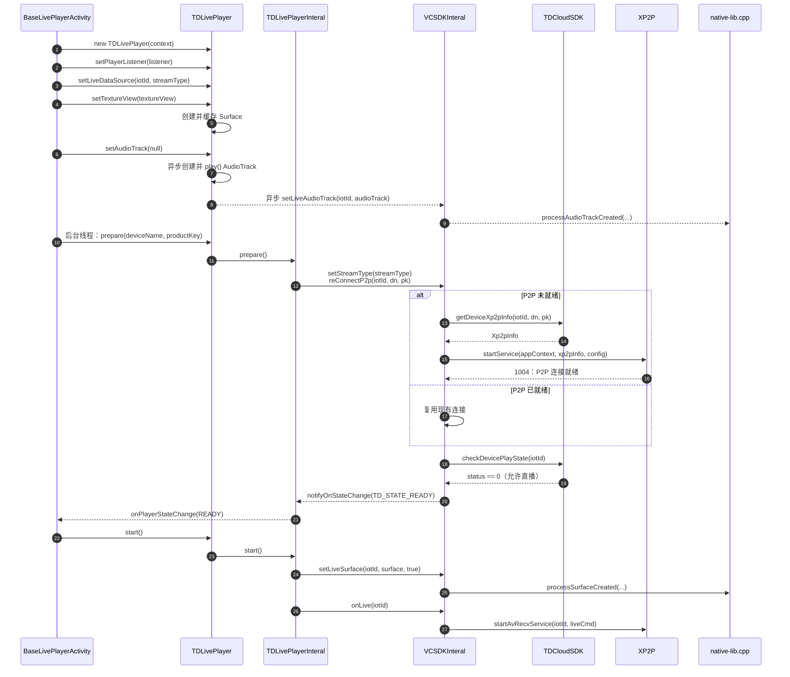

# iOS 腾讯设备播放器创建到 `startAvRecvService` 拉流时序图

> 范围：腾讯设备直播的冷启动路径，从 `LiveViewController` 创建 `CloudLivePlayer` 到 `TencentManager` 调用 `startAvRecvService`。已处于 P2P 就绪状态时，`TencentLivePlayer` 会跳过建连，直接进入直播状态查询。

## 源码依据

- `TendaSecurity/Classes/Main/Home/SubFunc/Live/ViewController/LiveViewController.mm`：创建 `CloudLivePlayer`，并在直播启动处调用 `start()`。
- `TestAliSDK/Container/CloudLivePlayer.mm`：根据 `provider` 创建腾讯播放器，并把 `start()` 转发给 `TencentLivePlayer`。
- `TestAliSDK/Internal/ImplManager/Tencent/TencentLivePlayer.mm`：P2P 就绪检查、`startToPlay` 的直播许可校验、媒体管线启动和 `startLiveWithIotId` 调用。
- `TestAliSDK/Internal/ImplManager/Tencent/TencentManager.mm`：P2P Token 查询、`1004` 处理、`startLiveWithIotId` 和最终的 `startAvRecvService` 调用。

## Android 腾讯设备播放器创建到 `startAvRecvService` 拉流

> 范围：腾讯设备直播的冷启动路径，从 `BaseLivePlayerActivity` 创建 `TDLivePlayer` 到 `VCSDKInteral` 调用 `XP2P.startAvRecvService`。`prepare()` 负责 P2P 信息查询、建连与设备直播状态校验；收到 `TD_STATE_READY` 后，业务层再调用 `start()` 启动收流。

### Android 关键点

- `setTextureView()` 只创建并缓存 `Surface`；`setAudioTrack(null)` 在异步任务中创建、`play()` 并调用 `setLiveAudioTrack(...)`，因此这条音频绑定链可与 `prepare()` 并行。
- P2P 建连入口是 `prepare()` 阶段的 `reConnectP2p(...)`，不是 `start()`。
- `1004` 仅表示 P2P 连接就绪；随后必须确认 `status == 0`，才向页面发出 `TD_STATE_READY`。
- 页面在 `onPlayerStateChange(READY)` 中通过 `executorService` 调用 `start()`；它绑定缓存的 `Surface`，再通过 `onLive(iotId)` 触发最终的 `startAvRecvService(...)`。

### Android 源码依据

- `tendasecurity-android/app/src/main/java/com/tenda/security/activity/live/BaseLivePlayerActivity.java`：`createPlayer()` 创建 `TDLivePlayer`；初始化阶段设置数据源；`onSurfaceTextureAvailable()` 调用 `setTextureView()`、`setAudioTrack(null)`，并在线程中执行 `prepare(deviceName, productKey)`；READY 回调中提交 `mPlayer.start()`。
- `TDLivePlayer` / `TDLivePlayerInteral`：播放器配置、音频异步初始化、`prepare()` 与 `start()` 的实现入口。
- `VCSDKInteral`：`reConnectP2p(...)`、P2P `1004` 处理、播放状态检查、JNI 转发和 `startAvRecvService(...)` 的调用入口。
