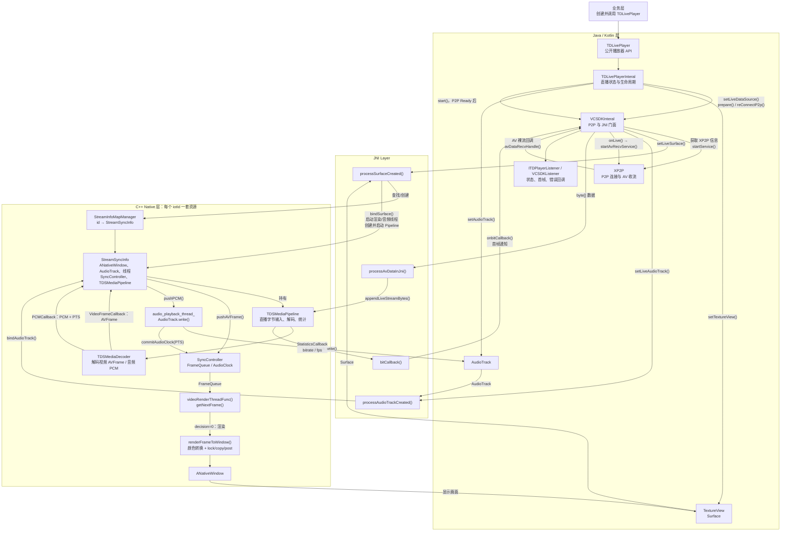
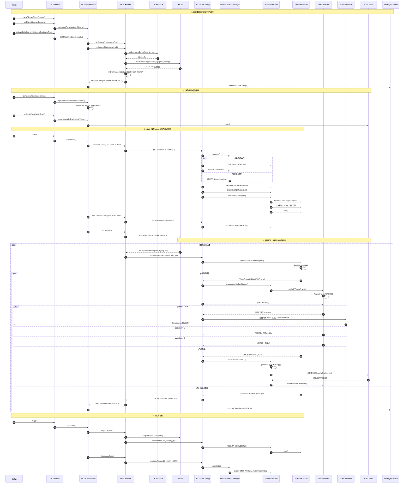

# new安防腾讯设备 Andriod 端直播流程解析

```mermaid
flowchart TD
    APP["业务层<br/>创建并调用 TDLivePlayer"]

    subgraph JAVA["Java / Kotlin 层"]
        LP["TDLivePlayer<br/>公开播放器 API"]
        LPI["TDLivePlayerInteral<br/>直播状态与生命周期"]
        VCI["VCSDKInteral<br/>P2P 与 JNI 门面"]
        XP2P["XP2P<br/>P2P 连接与 AV 收流"]
        LISTENER["ITDPlayerListener / VCSDKListener<br/>状态、首帧、错误回调"]
        SURFACE["TextureView<br/>Surface"]
        TRACK["AudioTrack"]
    end

    subgraph JNI["JNI Layer"]
        PS["processSurfaceCreated()"]
        PA["processAudioTrackCreated()"]
        PD["processAvDataInJni()"]
        BIT["bitCallback()"]
    end

    subgraph NATIVE["C++ Native 层：每个 iotId 一套资源"]
        MAP["StreamInfoMapManager<br/>id → StreamSyncInfo"]
        SSI["StreamSyncInfo<br/>ANativeWindow、AudioTrack、线程<br/>SyncController、TDSMediaPipeline"]
        PIPE["TDSMediaPipeline<br/>直播字节输入、解码、统计"]
        DECODER["TDSMediaDecoder<br/>解码视频 AVFrame / 音频 PCM"]
        SYNC["SyncController<br/>FrameQueue / AudioClock"]
        VTHREAD["videoRenderThreadFunc()<br/>getNextFrame()"]
        RENDER["renderFrameToWindow()<br/>颜色转换 + lock/copy/post"]
        ATHREAD["audio_playback_thread_<br/>AudioTrack.write()"]
        NWINDOW["ANativeWindow"]
    end

    APP --> LP
    LP --> LPI

    LPI -->|"setLiveDataSource()<br/>prepare() / reConnectP2p()"| VCI
    VCI -->|"获取 XP2P 信息<br/>startService()"| XP2P

    LPI -->|"setTextureView()"| SURFACE
    LPI -->|"setAudioTrack()"| TRACK

    LPI -->|"start()，P2P Ready 后"| VCI
    VCI -->|"setLiveSurface()"| PS
    VCI -->|"setLiveAudioTrack()"| PA
    VCI -->|"onLive() → startAvRecvService()"| XP2P

    SURFACE -->|"Surface"| PS
    TRACK -->|"AudioTrack"| PA

    PS -->|"查找/创建"| MAP
    MAP --> SSI
    PS -->|"bindSurface()<br/>启动渲染/音频线程<br/>创建并启动 Pipeline"| SSI
    PA -->|"bindAudioTrack()"| SSI

    XP2P -->|"AV 裸流回调<br/>avDataRecvHandle()"| VCI
    VCI -->|"byte[] 数据"| PD
    PD -->|"appendLiveStreamBytes()"| PIPE
    SSI -->|"持有"| PIPE
    PIPE --> DECODER

    DECODER -->|"VideoFrameCallback：AVFrame"| SSI
    SSI -->|"pushAVFrame()"| SYNC
    SYNC -->|"FrameQueue"| VTHREAD
    VTHREAD -->|"decision=0：渲染"| RENDER
    RENDER --> NWINDOW
    NWINDOW -->|"显示画面"| SURFACE

    DECODER -->|"PCMCallback：PCM + PTS"| SSI
    SSI -->|"pushPCM()"| ATHREAD
    ATHREAD -->|"AudioTrack.write()"| TRACK
    ATHREAD -->|"commitAudioClock(PTS)"| SYNC

    PIPE -->|"StatisticsCallback<br/>bitrate / fps"| BIT
    BIT -->|"onbitCallback()<br/>首帧通知"| VCI
    VCI --> LISTENER
```

```mermaid
classDiagram
    direction TB

    class TDLivePlayer {
        <<对外公开门面>>
        -boolean isRelease  当前未使用的释放标记

        +TDLivePlayer(Context) 将应用上下文传给父类
        +setDataSource(String) 设置通用播放地址并校验参数
        +setLiveDataSource(String, TDStreamType) 设置直播设备与码流类型
        +setTextureView(TextureView) 设置视频显示容器
        +setAudioTrack(AudioTrack) 设置音频播放实例
        +start() 启动直播
        +prepare(String, String) 建立或准备P2P连接
        +reStartPlay() 停止后强制重新连接并播放
        +stop() 停止直播并释放Native渲染资源
        +reset() 重置播放器播放状态
        +release() 释放播放器对象与监听器
        +setDecoderStrategy(TDDecoderStrategy) 设置解码策略接口
        +setPlayerListener(ITDPlayerListener) 设置上层播放状态监听
        +StartPTZMove(int, int, int) 发起云台控制
        +getCurrentRecordingContentDurationInMs() 获取当前录制时长
        +initFrameMap(String) 重置首帧标记
        +enableVideoBox(boolean) 开关SEI视频检测框
    }

    class TDLivePlayerInteral {
        <<核心实现层>>
        #String mIotId 当前播放设备标识
        #String deviceName 设备名称
        #String productKey 产品Key
        #Context applicationContext 应用上下文
        -LVLivePlayer mAliLivePlayer 阿里播放器实例
        -AudioTrack mAudioTrack 音频输出对象
        -Surface surface 视频输出Surface
        -ITDPlayerListener mPlayerListener 业务侧监听器
        -SnapShotListener mSnapShotListener 截图监听器
        -boolean isTxPullingStream 腾讯是否正在收流
        -boolean isSetLiveSurface 是否已经绑定渲染Surface
        -boolean isAvailable 播放器是否可用
        -boolean mMute 当前静音状态
        -long mRecordDuration 当前录制时长

        +getIotId() 获取当前设备id
        +setDataSource(String) 校验通用播放地址
        +setLiveDataSource(String, TDStreamType) 设置设备及清晰度
        +setLiveDataSource(String, String, String, TDStreamType) 设置设备信息并准备P2P
        +setTextureView(TextureView) 从TextureView创建Surface
        +setAudioTrack(AudioTrack) 创建或绑定AudioTrack
        +setAudioTrackNewestId(String) 预留的音频流切换接口

        +start() 绑定Surface和音频并启动直播
        +startAv() P2P就绪后仅发起AV收流
        +prepare(String, String) 发起P2P连接准备
        +reConnectP2p(String, String, String) 按当前状态重连P2P
        +forceConnectP2p(String, String, String) 强制停止旧连接后重连
        +stop() 停止收流并清理Native资源
        +reset() 重置播放状态
        +release() 释放Java侧音频和监听器

        +getBackgroundThumb() 获取直播背景缩略图
        +snapShot(SnapShotListener) 截取当前视频画面
        +startRecordingContent(String) 开始录制直播内容
        +stopRecordingContent() 停止录制直播内容
        +changeQuality(TDStreamType) 切换主码流或子码流
        +resetQuality(TDStreamType) 重置当前清晰度
        +mute(boolean) 设置静音状态
        +isMute() 查询是否静音
        +audioFocus() 获取音频焦点
        +isAudioFocus() 查询音频焦点状态
        +setVideoScalingMode(LVVideoScalingMode) 设置视频缩放方式
        +setDecoderStrategy(TDDecoderStrategy) 设置解码策略接口
        +PTZMove(int, int, int) 控制摄像头云台

        +getPlayerState() 获取当前播放器状态
        +setCurrentState(TDPlayerState) 更新播放器状态
        +setPlayerListener(ITDPlayerListener) 注册业务层监听器
        +initFrameMap(String) 清除首帧渲染标记
        +enableVideoBox(boolean) 控制SEI检测框显示

        +onStateChange(TDPlayerState, int, String) 转发播放状态给业务层
        +onPlayError(int, String, String) 转发播放错误给业务层
        +onFirstFrameRendered(String) 处理首帧渲染完成事件
        +onCommandResponse(CommandResponse) 处理设备命令响应
        +onError(LVPlayerError) 转换阿里播放器错误
        +onPlayerStateChange(LVPlayerState) 转换阿里播放器状态
        +onRenderedFirstFrame(int) 接收阿里首帧回调
        +onVideoFrameUpdate(int, int, long) 接收阿里视频帧回调
        +onAudioHeader(int, int, int) 接收阿里音频头信息
        +onAudioData(byte[], int, long) 接收阿里音频数据
        +onVideoSizeChanged(int, int) 接收阿里视频尺寸变化
        +onSeiInfoUpdate(byte[], int, long) 接收SEI信息
    }

    TDLivePlayer --|> TDLivePlayerInteral
```

```mermaid
sequenceDiagram
    autonumber

    participant App as 业务层
    participant Player as TDLivePlayer
    participant Internal as TDLivePlayerInteral
    participant VCI as VCSDKInteral
    participant Cloud as TDCloudSDK
    participant XP2P as XP2P
    participant JNI as JNI / native-lib.cpp
    participant Map as StreamInfoMapManager
    participant Stream as StreamSyncInfo
    participant Pipeline as TDSMediaPipeline
    participant Sync as SyncController
    participant Window as ANativeWindow
    participant Track as AudioTrack
    participant Listener as ITDPlayerListener

    Note over App,Listener: 1. 配置播放器并建立 P2P 连接

    App->>Player: new TDLivePlayer(context)
    App->>Player: setPlayerListener(listener)
    Player->>Internal: super.setPlayerListener(listener)

    App->>Player: setLiveDataSource(iotId, dn, pk, streamType)
    Player->>Internal: 继承的 setLiveDataSource(...)
    Internal->>VCI: setStreamType(streamType)
    Internal->>VCI: reConnectP2p(iotId, dn, pk)
    VCI->>Cloud: getDeviceXp2pInfo(iotId, dn, pk)
    Cloud-->>VCI: Xp2pInfo
    VCI->>XP2P: startService(appContext, xp2pInfo, config)

    XP2P-->>VCI: 1004 P2P连接就绪
    VCI->>VCI: 更新 mConnectedStack 为 DETECT_READY
    VCI-->>Internal: onStateChange(BUFFERING / READY)
    Internal-->>Listener: onPlayerStateChange(...)

    Note over App,Track: 2. 准备视频与音频输出

    App->>Player: setTextureView(textureView)
    Player->>Internal: super.setTextureView(textureView)
    Internal->>Internal: 从 SurfaceTexture 创建 Surface

    App->>Player: setAudioTrack(audioTrack)
    Player->>Internal: super.setAudioTrack(audioTrack)
    Internal->>Track: play()

    Note over App,Pipeline: 3. start 创建 Native 渲染与解码管线

    App->>Player: start()
    Player->>Internal: super.start()

    Internal->>VCI: setLiveSurface(iotId, surface, true)
    VCI->>JNI: processSurfaceCreated(...)

    JNI->>Map: find(iotId)
    alt 当前流不存在
        JNI->>Stream: new StreamSyncInfo()
        JNI->>Map: set(iotId, streamInfo)
    else 当前流已存在
        Map-->>JNI: 返回已有 StreamSyncInfo
    end

    JNI->>Stream: bindSurface(ANativeWindow)
    JNI->>Stream: 启动渲染线程和音频播放线程
    JNI->>Stream: initMediaPipeline(iotId)
    Stream->>Pipeline: new TDSMediaPipeline(iotId)
    Stream->>Pipeline: 注册视频、PCM、统计回调
    Stream->>Pipeline: start()

    Internal->>VCI: setLiveAudioTrack(iotId, audioTrack)
    VCI->>JNI: processAudioTrackCreated(...)
    JNI->>Stream: bindAudioTrack(audioTrack)

    Internal->>VCI: onLive(iotId)
    VCI->>XP2P: startAvRecvService(iotId, liveCmd)

    Note over XP2P,Track: 4. 循环接收、解码并输出音视频

    loop 每段直播码流
        XP2P-->>VCI: avDataRecvHandle(iotId, byte[], len)
        VCI->>JNI: processAvDataInJni(iotId, data, len)
        JNI->>Pipeline: appendLiveStreamBytes(data)

        Pipeline->>Pipeline: 解复用与音视频解码

        par 视频帧路径
            Pipeline-->>JNI: VideoFrameCallback(AVFrame)
            JNI->>Stream: renderVideoCallback(frame)
            Stream->>Sync: pushAVFrame(frame)
            Sync->>Sync: FrameQueue 缓存视频帧
            JNI->>Sync: getNextFrame()

            alt decision = 0
                Sync-->>JNI: 返回待渲染 AVFrame
                JNI->>Window: 颜色转换、lock、复制、unlockAndPost
                Window-->>App: TextureView 显示视频
            else decision = 1
                Sync-->>JNI: 视频过早，等待 waitMs
            else decision = 2
                Sync-->>JNI: 视频落后，丢弃帧
            end

        and 音频路径
            Pipeline-->>JNI: PCMCallback(PCM, PTS)
            JNI->>Stream: renderAudioFrame(...)
            Stream->>Stream: pushPCM() 写入PCM缓存
            Stream->>Track: 音频线程调用 AudioTrack.write()
            Track-->>Stream: 返回实际写入字节数
            Stream->>Sync: commitAudioClock(PTS)

        and 统计与首帧通知
            Pipeline-->>JNI: StatisticsCallback(bitrate, fps)
            JNI-->>VCI: onbitCallback(iotId, bitrate, fps)
            VCI-->>Internal: onFirstFrameRendered(iotId)
            Internal-->>Listener: onPlayerStateChange(READY)
        end
    end

    Note over App,Pipeline: 5. 停止与释放

    App->>Player: stop()
    Player->>Internal: super.stop()
    Internal->>VCI: stopLive(iotId)
    VCI->>XP2P: stopAvRecvService(iotId)
    VCI->>JNI: processStopLive(iotId) 后台执行
    JNI->>Stream: 停止同步、渲染与音频线程
    Stream->>Pipeline: stop()

    Internal->>VCI: releaseLive(iotId)
    VCI->>JNI: processReleaseLive(iotId) 后台执行
    JNI->>Map: erase(iotId)
    Map->>Stream: clear() 并释放 Window、AudioTrack 等资源
```