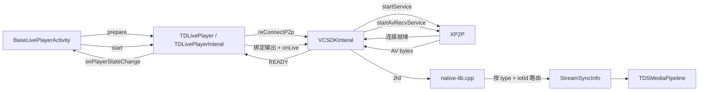
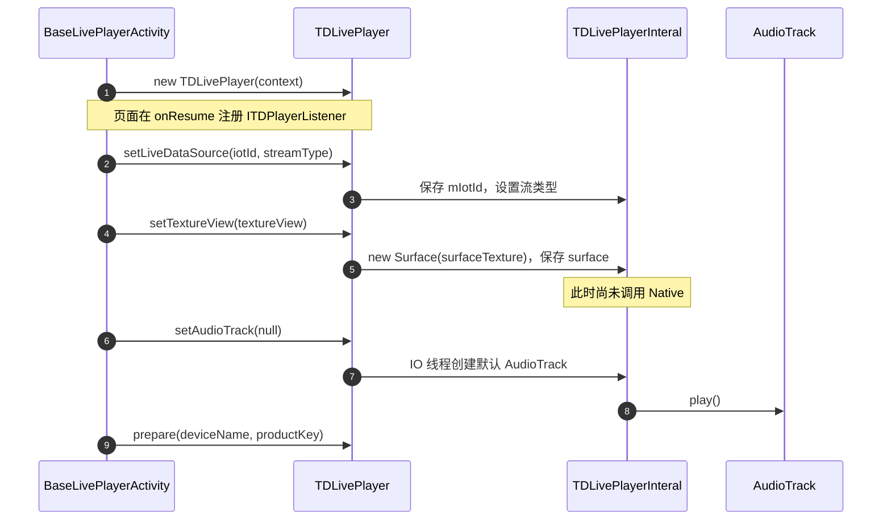
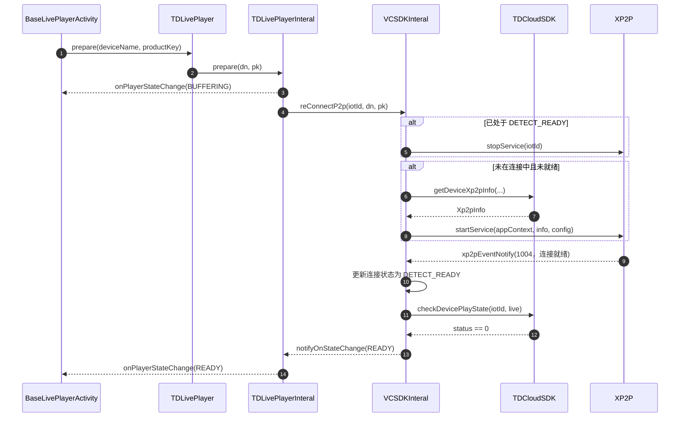
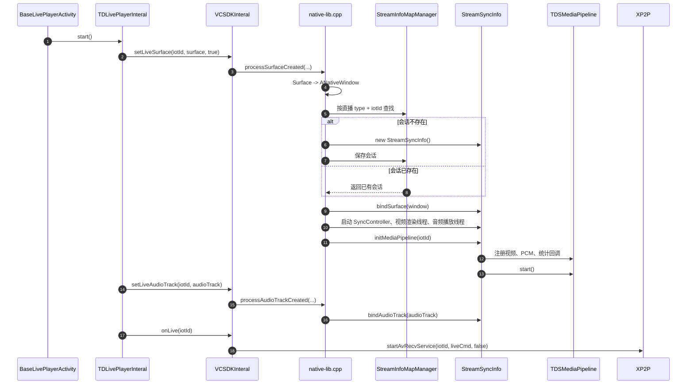
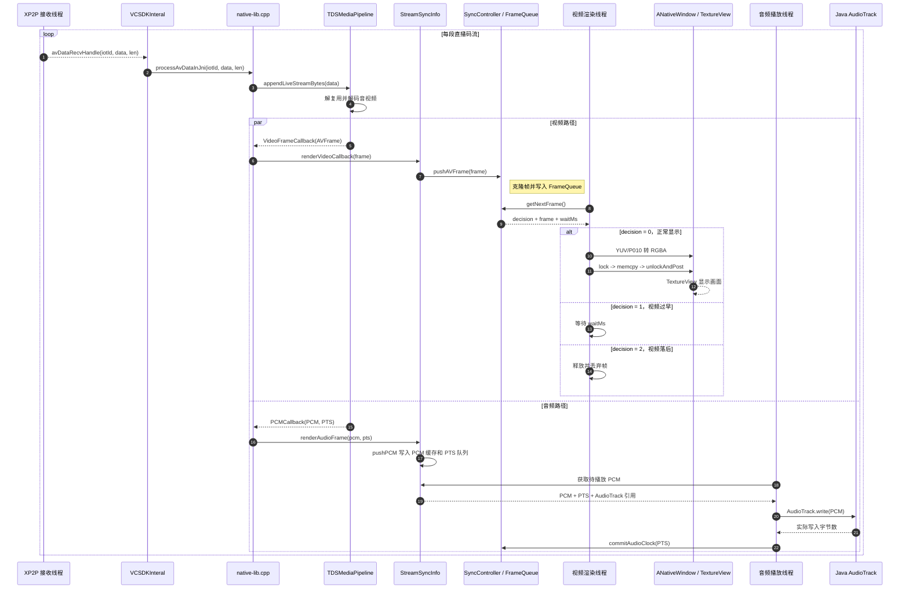
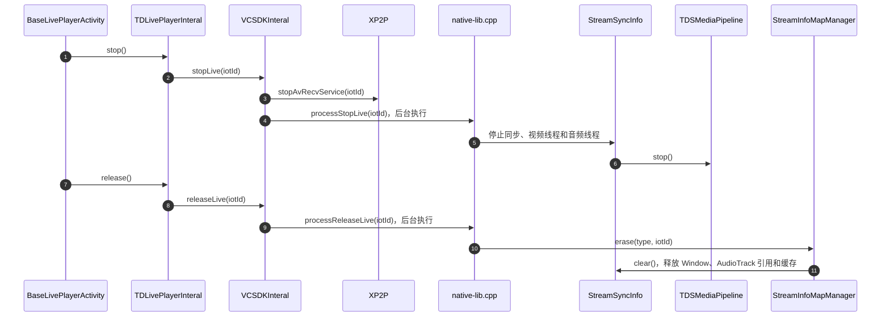

# 安防腾讯设备 Android 端直播流程解析

> 范围：本文只描述腾讯设备的 `XP2P` 直播链路；阿里设备的 `LVLivePlayer` 路径不在本文范围内。
>
> 阅读目标：回答四个问题：P2P 在哪里建立、`READY` 表示什么、码流如何到达屏幕和扬声器、停止时资源如何释放。

## 1. 先看结论

腾讯直播的调用分为控制面和数据面，不能把 `prepare()` 与 `start()` 当成同一件事：

1. `prepare(dn, pk)` 发起 P2P 建连，并等待设备进入可播放状态。
2. `READY` 表示连接和设备状态已满足播放条件，页面此时调用 `start()`。
3. `start()` 将 Java 的 `Surface`、`AudioTrack` 绑定到 Native，并调用 `startAvRecvService()` 开始接收音视频码流。
4. 码流通过 JNI 进入 `TDSMediaPipeline` 解码；视频渲染到 `ANativeWindow`，PCM 写入 `AudioTrack`。
5. 首帧渲染是独立事件，语义上晚于 `READY`，不能将两者混为一谈。



## 2. 核心对象与职责

主链路中的对象各有明确边界。读代码时先区分“谁负责建立连接”与“谁负责消费媒体数据”。

| 对象 | 核心职责 |
| --- | --- |
| `BaseLivePlayerActivity` | 页面生命周期、准备 `TextureView`、处理播放器回调 |
| `TDLivePlayer` | 对业务层暴露统一播放器 API |
| `TDLivePlayerInteral` | 腾讯/阿里分流、播放器状态、Surface/AudioTrack 的 Java 侧持有 |
| `VCSDKInteral` | P2P 生命周期、XP2P 回调、Java 到 JNI 的协调 |
| `native-lib.cpp` | JNI 桥接、查找/创建 Native 会话、转交输入数据 |
| `StreamSyncInfo` | 一路 Native 播放会话：窗口、音轨、管线、缓存和线程 |
| `TDSMediaPipeline` | 解复用、解码、视频帧/PCM/统计回调 |
| `SyncController` | 视频帧队列与呈现节奏决策 |

`VCSDKInteral` 是全局协调者；`StreamSyncInfo` 是单路媒体会话。Native 层的会话注册表实际按 **播放类型 + iotId** 查找，直播、本地回放和云回放使用不同的管理器，不能简单理解为“每个 iotId 只有一个对象”。

## 3. 页面初始化与输出准备

播放器对象创建、显示容器准备和 P2P 建连是三个独立步骤。当前常规 `TextureView` 路径的实际顺序如下：



### 3.1 `setLiveDataSource()` 只设置播放对象

`setLiveDataSource(iotId, streamType)` 保存当前设备标识并设置码流类型。

### 3.2 `setTextureView()` 只保存 Java Surface

`setTextureView()` 用 `textureView.getSurfaceTexture()` 创建 `Surface` 并保存到 `TDLivePlayerInteral`。真正的 Native 绑定发生在随后 `start()` 调用的 `setLiveSurface()` 中，JNI 才会把 `Surface` 转换为 `ANativeWindow`。

### 3.3 `setAudioTrack()` 是异步准备

传入 `null` 时，方法在 IO 线程创建默认的单声道、8 kHz、PCM 16-bit `AudioTrack`。创建成功后才调用 `play()`，并异步将它交给 `VCSDKInteral.setLiveAudioTrack()`。因此在排查无声问题时，除了检查解码 PCM，还要确认 `AudioTrack` 初始化状态和绑定时机。

### 3.4 监听器注册时机

状态的完整转发链路是：

```text
Activity.setPlayerListener(this)
  -> TDLivePlayerInteral.setPlayerListener(...)
  -> VCSDKInteral.addListener(...)
  -> VCSDKInteral.notifyOnStateChange(...)
  -> TDLivePlayerInteral.onStateChange(...)
  -> 主线程 Handler
  -> Activity.onPlayerStateChange(...)
```

当前页面在 `onResume()` 注册业务监听器。实现上应保证它早于 `prepare()`；否则网络极快时，早期状态事件存在无法被页面接收的风险。

## 4. P2P 建连：从 prepare 到 READY

腾讯设备的 P2P 建连从 `prepare()` 开始，而非 `start()`。此阶段只解决“能否收流”，尚未创建 Native 解码/渲染会话。需要特别区分：P2P 事件 `1004` 仅表示底层连接已就绪；只有云端播放状态检查返回 `status == 0`，播放器才会进入 `READY`。



`checkDevicePlayState(iotId, "live")` 的返回值分支如下：

```text
status == 0
  -> 设备直播状态可用
  -> notifyOnStateChange(READY)

status != 0，或请求失败
  -> 1 秒后重试 checkDevicePlayState()
  -> 累计第 3 次仍失败：notifyOnStateChange(ENDED) + notifyOnPlayError(...)
```

因此，`READY` 的完整条件是：**XP2P 已产生 1004 连接就绪事件，且云端直播状态检查返回 `status == 0`**。它不是单纯的“网络已连通”，也不是“首帧已经显示”。

状态应按业务含义解读，而不是按名称猜测：

| 状态 | 当前语义 | 页面通常动作 |
| --- | --- | --- |
| `BUFFERING` | 正在建立/恢复播放条件 | 显示加载状态，不启动 Native 收流 |
| `READY` | P2P 已连接，且 `checkDevicePlayState(..., "live")` 返回 `status == 0` | 调用 `mPlayer.start()` |
| 首帧回调 | 已经有一帧完成渲染 | 隐藏封面或加载动画 |
| `ENDED` / 错误 | 播放结束或失败 | 显示结束、错误或重连 UI |

## 5. READY 后启动收流与 Native 会话

`READY` 的处理点是页面。页面调用 `mPlayer.start()` 后，Java 侧绑定输出目标，Native 创建或复用对应会话，最后 XP2P 才开始推送 AV 数据。



这里有两个容易混淆的点：

- `Surface` 与 `AudioTrack` 是 Java 对象；`StreamSyncInfo` 内部保存的是 `ANativeWindow` 和 `AudioTrack` 的 JNI 全局引用，目的是让长期运行的 Native 线程可以安全使用它们。
- `ensureRenderThreadRunning(..., true, ...)` 同时启动同步控制、视频消费线程和音频播放线程。它只是启动消费者；真正的数据生产者是稍后 XP2P 的 AV 回调。

## 6. 码流、解码与音视频渲染

`startAvRecvService()` 成功后，XP2P 通过 `avDataRecvHandle()` 持续回传 AV 字节。`VCSDKInteral` 不解码数据，只将它转交 JNI；后续解码与渲染都发生在单路 `StreamSyncInfo` 所属的 Native 会话中。



### 6.1 视频路径

视频帧由 `TDSMediaPipeline` 的 `VideoFrameCallback` 输出。`StreamSyncInfo` 将帧交给 `SyncController` 的 `FrameQueue`，视频渲染线程调用 `getNextFrame()` 获取呈现决策：正常渲染、等待或丢帧。正常帧经颜色转换后写入 `ANativeWindow`，最终由 `TextureView` 显示。

### 6.2 音频路径

PCM 由 `PCMCallback` 输出后写入 `StreamSyncInfo` 的缓存。独立音频线程取出 PCM 并经 JNI 调用 `AudioTrack.write()`；成功写入后提交音频时钟。

需要注意当前腾讯直播初始化中调用了 `sync_controller_->setSyncEnabled(false)`。因此 `SyncController` 虽然保留音频时钟和视频队列能力，但不能在文档中笼统表述为“当前直播始终严格音画同步”。

### 6.3 首帧、统计与状态不是一件事

码率、帧率等统计由 `StatisticsCallback` 上报；首帧渲染则通过 `onFirstFrameRendered()` 通知业务侧。它们与 `READY` 分属不同阶段：

```text
P2P/设备状态满足条件 -> READY -> startAvRecvService
  -> 接收并解码首批数据 -> 渲染第一帧 -> FirstFrameRendered
```

排查“已 READY 但黑屏”时，应从 `startAvRecvService`、`avDataRecvHandle`、`appendLiveStreamBytes`、视频回调和 `ANativeWindow` 写入依次确认，而不是只看 P2P 连接状态。

### 6.4 线程切换状态
```
XP2P 回调线程
  -> processAvDataInJni()
  -> TDSMediaPipeline PacketQueue
       -> 视频解码线程 -> FrameQueue -> 视频渲染线程 -> ANativeWindow
       -> 音频解码线程 -> PCM 缓存  -> 音频播放线程 -> AudioTrack
```


## 7. 停止与释放

停止播放与销毁会话是两个阶段。前者停止工作，后者移除对象所有权。



| 调用 | 语义 | Native 会话是否仍可能存在 |
| --- | --- | --- |
| `stop()` | 停止 AV 收流、管线和消费线程 | 是，等待 `release()` 清除 |
| `release()` | 解除监听、释放 Java 侧对象，并删除 Native 会话 | 否，注册表项被移除 |

因此 `StreamSyncInfo` 的生命周期不跟随某个 Java `TDLivePlayer` 实例自动结束，而是由 Native 注册表的 `erase(type, iotId)` 显式终结。播放器 `release()` 必须可靠触发这一条路径，才能避免窗口、全局引用、线程和解码资源残留。

## 8. 关键代码定位

以下路径均相对于 Android 工程根目录 `tendasecurity-android/`，阅读流程时建议按本文章节顺序跳转：

| 场景 | 关键方法 | 源码位置 |
| --- | --- | --- |
| 创建播放器、页面入口 | `createPlayer()` | `app/src/main/java/com/tenda/security/activity/live/BaseLivePlayerActivity.java:483` |
| Surface 准备、设置输出并 prepare | `onSurfaceTextureAvailable(...)` | `app/src/main/java/com/tenda/security/activity/live/BaseLivePlayerActivity.java:3496` |
| READY 后调用 start | `onPlayerStateChange(...)` | `app/src/main/java/com/tenda/security/activity/live/BaseLivePlayerActivity.java:3529` |
| 腾讯 P2P 入口 | `TDLivePlayerInteral.prepare(...)` | `vcsdk/src/main/java/com/tenda/vcsdk/interal/player/TDLivePlayerInteral.java:345` |
| 业务监听器注册与转发 | `setPlayerListener(...)`、`onStateChange(...)` | `vcsdk/src/main/java/com/tenda/vcsdk/interal/player/TDLivePlayerInteral.java:777, 887` |
| XP2P 数据回调进入 JNI | `VCSDKInteral.avDataRecvHandle(...)` | `vcsdk/src/main/java/com/tenda/vcsdk/interal/VCSDKInteral.java:627` |
| 开始 AV 收流 | `VCSDKInteral.onLive(...)` | `vcsdk/src/main/java/com/tenda/vcsdk/interal/VCSDKInteral.java:918` |
| Surface/会话/管线初始化 | `processSurfaceCreated(...)` | `vcsdk/src/main/cpp/native-lib.cpp:1123` |
| 渲染和音频线程启动 | `ensureRenderThreadRunning(...)` | `vcsdk/src/main/cpp/native-lib.cpp:912` |
| AV 数据投喂管线 | `processAvDataInJni(...)` | `vcsdk/src/main/cpp/native-lib.cpp:1070` |
| 单路会话资源定义 | `StreamSyncInfo` | `vcsdk/src/main/cpp/StreamSyncInfo.hpp:75` |
