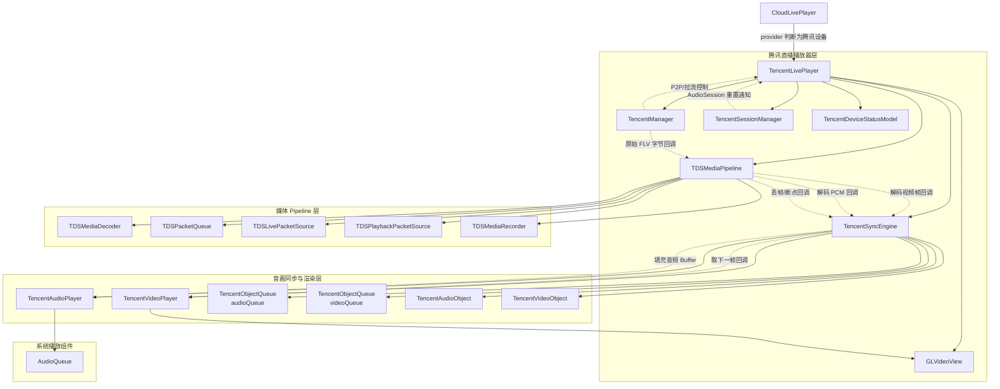
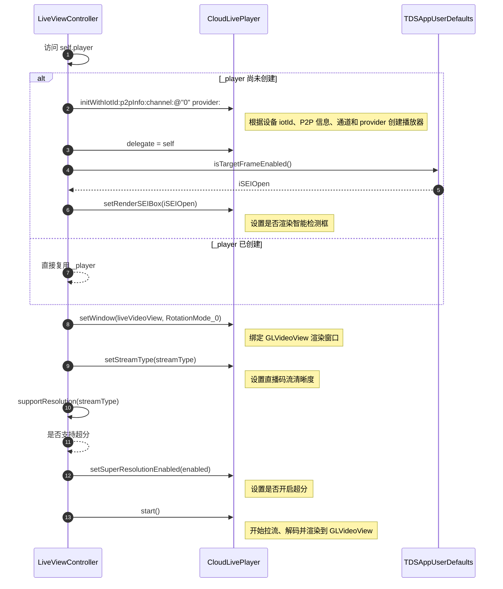
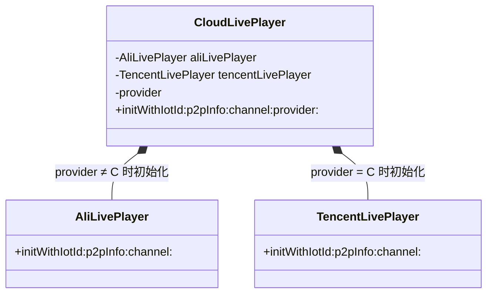
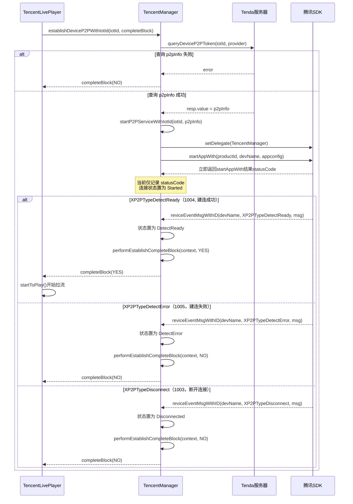
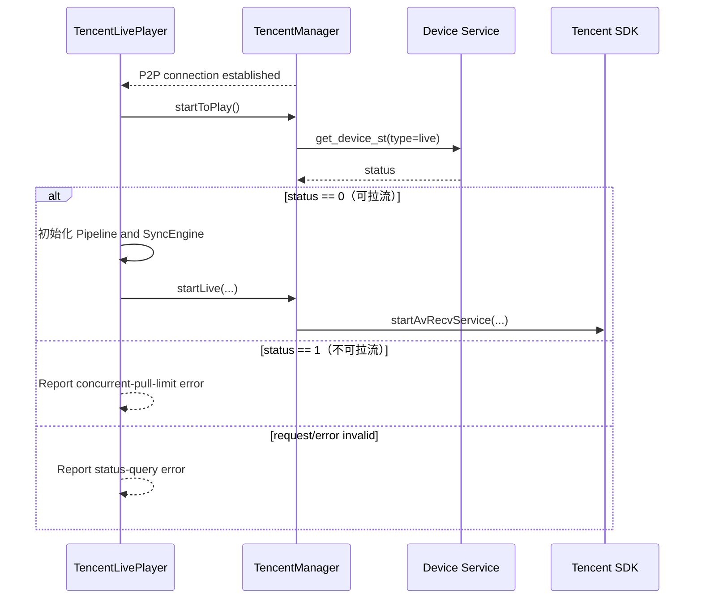
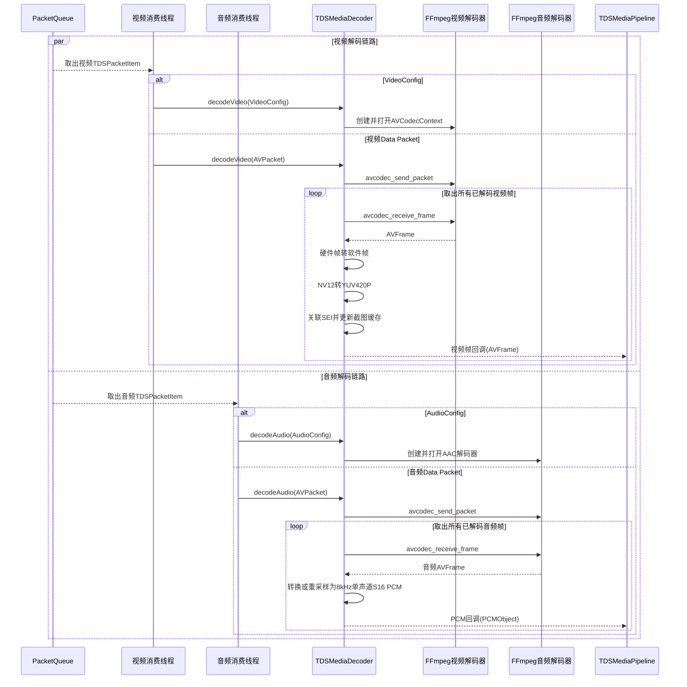
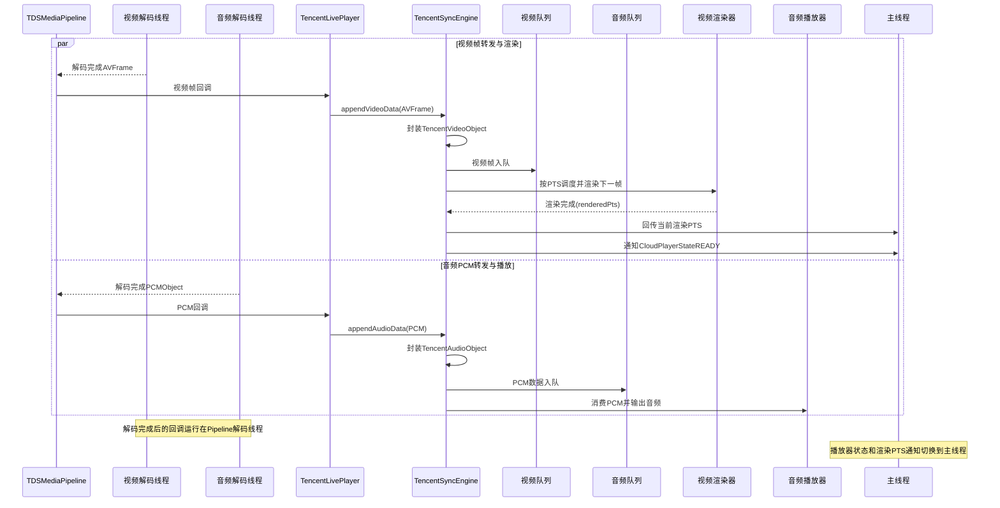
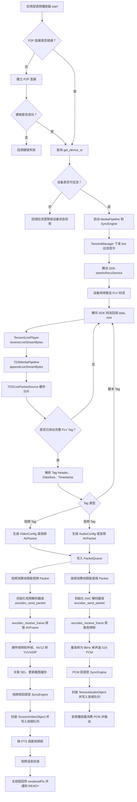

```mermaid
sequenceDiagram
    participant Player as 播放器
    participant Manager as TencentManager
    participant Device as 设备
    participant SDK as 腾讯SDK
    participant Pipeline as TDSMediaPipeline
    participant Source as TDSLivePacketSource
    participant Queue as 音视频PacketQueue

    Player->>Manager: 下发拉流信令
    Manager->>SDK: startAvRecvService
    SDK->>Device: 建立拉流
    Device-->>SDK: 持续推送FLV码流

    loop 每次腾讯SDK码流回调
        SDK-->>Manager: data, size
        Manager-->>Player: data, size
        Player->>Pipeline: appendLiveStreamBytes(data, size)
        Pipeline->>Source: appendBytes(data, size)
        Source->>Source: 追加数据到streamBuffer

        opt 流首包包含FLV文件头
            Source->>Source: 解析并跳过FLV Header和PreviousTagSize0
        end

        loop 循环尝试解析缓冲区中的FLV Tag
            Source->>Source: 读取11字节Tag Header
            Source->>Source: 获取TagType、DataSize、Timestamp

            alt Tag数据未收完整
                Source->>Source: 保留剩余数据并停止本轮解析
                Note over Source: 等待下一次SDK回调继续拼接
            else Tag数据完整
                Source->>Source: 校验PreviousTagSize

                alt 视频Tag
                    Source->>Source: 解析H.264或H.265配置帧/视频帧
                    Source->>Source: 生成VideoConfig或Video AVPacket
                else 音频Tag
                    Source->>Source: 解析AAC配置帧/音频帧
                    Source->>Source: 生成AudioConfig或Audio AVPacket
                else 脚本Tag
                    Source->>Source: 忽略脚本数据
                end
            end
        end

        Source-->>Pipeline: 返回已解析的TDSPacketItem列表

        loop 处理每个TDSPacketItem
            opt Video Data Packet且当前处于Normal状态
                Pipeline->>Queue: 计算预测缓存时长
                Note over Pipeline,Queue: 直播缓存时长上限：<br/>LowLatency > 500ms，Balanced > 1000ms，Smooth > 2000ms

                alt 预测缓存时长超过当前模式上限
                    Pipeline->>Queue: trimDataToLatestVideoKeyFrame()
                    Queue->>Queue: 从队尾向前查找最新Video Data关键帧

                    alt 队列中存在最新关键帧
                        Queue->>Queue: 丢弃该关键帧之前的全部Data Packet
                        Note over Queue: 丢弃旧视频帧和旧音频帧；<br/>保留VideoConfig、AudioConfig等控制包，<br/>保留最新关键帧及其后的Data Packet
                        Queue-->>Pipeline: foundKeyFrame = true, keyFrameTimestamp

                        Pipeline->>Queue: 计算裁剪后的预测缓存时长
                        Pipeline->>Pipeline: notifyPlaybackDiscontinuity(keyFrameTimestamp)

                        alt 剩余缓存时长 <= 当前模式上限
                            Pipeline->>Pipeline: 保持Normal状态
                        else 剩余缓存时长仍超过上限
                            Pipeline->>Pipeline: 进入WaitingForKeyFrame状态
                            Note over Pipeline: 后续音频Data Packet和非关键视频Data Packet不再入队
                        end

                    else 队列中不存在视频关键帧
                        Queue->>Queue: 清空整个队列并递增serial
                        Note over Queue: 所有Data Packet被计入丢弃统计；<br/>配置包和其他控制包也会被清空
                        Queue-->>Pipeline: foundKeyFrame = false
                        Pipeline->>Pipeline: 进入WaitingForKeyFrame状态
                    end
                end
            end

            alt WaitingForKeyFrame状态
                alt 音频Data Packet或非关键视频Data Packet
                    Pipeline->>Pipeline: 丢弃当前Packet
                else 当前Packet是视频关键帧
                    Pipeline->>Queue: 丢弃队列内剩余全部音视频Data Packet
                    Pipeline->>Queue: 插入Video Flush和Audio Flush
                    Pipeline->>Pipeline: notifyPlaybackDiscontinuity(keyFrameTimestamp)
                    Pipeline->>Pipeline: 恢复Normal状态
                    Pipeline->>Queue: 写入当前视频关键帧
                else 当前Packet是VideoConfig或AudioConfig
                    Pipeline->>Queue: 写入当前配置Packet
                end
            else Normal状态
                Pipeline->>Queue: 写入当前Packet
            end

            opt 本次视频Data Packet已成功写入PacketQueue
                Pipeline->>Pipeline: tryOpenInitialDecodeGate()
                Pipeline->>Queue: 查询视频Data Packet数量

                Note over Pipeline,Queue: 初始视频Packet阈值：<br/>LowLatency >= 1，Balanced >= 6，Smooth >= 13
                alt 达到当前缓冲模式的初始视频Packet阈值
                    Pipeline->>Pipeline: initialDecodeGateOpen = true
                    Pipeline->>Pipeline: initialDecodeCondition.notify_all()
                    Note over Pipeline: 唤醒等待初始缓冲的音视频消费线程
                end
            end
        end
    end
```

# 安防腾讯设备直播流程解析
#### 类依赖关系


#### 类的职责
##### 外层播放器
`CloudLivePlayer`：统一对外提供直播播放接口，根据设备厂商选择初始化阿里或腾讯播放器。
`TencentLivePlayer`：腾讯直播业务封装，负责设备连接、拉流控制、播放状态、截图、录制和对外回调。
##### 腾讯业务组件
`TencentManager`：负责腾讯设备 P2P 连接、开始/停止拉流、设备控制和原始 FLV 数据回调。
`TencentSessionManager`：监听和处理音频会话重置、系统音频中断等事件。
`TencentDeviceStatusModel`：解析设备视频状态查询结果，例如是否允许拉流。
##### 媒体 Pipeline
`TDSMediaPipeline`：媒体处理总入口，负责接收数据、管理线程、队列、解码、丢帧、录制和 EOS。
`TDSLivePacketSource`：处理直播 FLV 字节流输入。
`TDSPlaybackPacketSource`：处理本地回放或云存回放的FLV/M3U8字节流输入。
`TDSPacketQueue`：缓存压缩后的音视频 packet，并负责按媒体类型出队、限流和丢帧。
`TDSMediaDecoder`：调用 FFmpeg 解码视频帧和 PCM 音频。
~~`TDSMediaRecorder`：将收到的媒体数据写入录像文件。
音视频同步与渲染~~
`TencentSyncEngine`：管理解码后的音视频队列、音频时钟、视频 PTS 调度、暂停恢复、seek 和倍速切换。
`TencentObjectQueue`：缓存解码后的音频对象和视频对象。
`TencentAudioObject`：封装一段 PCM 音频数据及其 PTS、时长。
`TencentVideoObject`：封装一帧 AVFrame 及其 PTS、时长。
`TencentAudioPlayer`：管理 AudioQueue，向系统音频缓冲区填充 PCM，并更新音频时钟。
`TencentVideoPlayer`：管理视频渲染定时器，根据 PTS 触发下一帧渲染。
`GLVideoView`：执行 OpenGL 视频渲染、超分渲染、截图和视频录制。

#### 直播流程拆解
- 直播页面内初始化`CloudLivePlayer`

*关键代码：*
```objc
- (CloudLivePlayer *)player{
    if (!_player) {
        // 根据 iotId、channel、provider 来初始化 player
        _player = [[CloudLivePlayer alloc] initWithIotId:_model.iotId p2pInfo:_model.p2pInfo channel:@"0" provider:_model.provider];
        // 设置代理
        _player.delegate = self;
        BOOL iSEIOpen = [TDSAppUserDefaults isTargetFrameEnabled];
        // 设置是否渲染智能框
        [_player setRenderSEIBox:iSEIOpen];
    }
    return _player;
}

// 设置渲染窗口，类型为GLVideoView
[self.player setWindow:self.liveVideoView videoRotationMode:CloudPlayerRotationMode_0_CLOCKWISE];
// 设置码流清晰度
[self.player setStreamType:streamType];
// 设置超分开关
[self.player setSuperResolutionEnabled:[self supportResolution:streamType]];
// 开始拉流
[self.player start];
```

*时序图：*

---

- 初始化`TencentLivePlayer`
`CloudLivePlayer`内部会根据传入的 `provider` 来决定初始化`AliLivePlayer`或`TencentLivePlayer`
`provider` 值为 `C` 时，初始化`TencentLivePlayer`


```objc
/// 判断播放器类型
- (CloudLivePlayerType)determinePlayerType {
    if ([_provider isTencentDevice]) {
        return CloudLivePlayerTypeTencent;
    }
    return CloudLivePlayerTypeAli;
}

/// 初始化播放器
- (void)initialPlayer {
    if (_playerType == CloudLivePlayerTypeAli) {
        _aliPlayer = [[AliLivePlayer alloc] initWithIotId:_iotId];
        _aliPlayer.delegate = self;
    } else {
        _tcPlayer = [[TencentLivePlayer alloc] initWithIotId:_iotId p2pInfo:_p2pInfo channel:_channel];
        _tcPlayer.delegate = self;
    }
}
```
```objc
@implementation NSString (Provider)

- (BOOL)isTencentDevice {
    return [self isEqualToString:@"C"];
}

@end
```

*类图：*


---

- 建立 `P2P` 链接
在调用 `start` 方法后，会在 `TencentLivePlayer` 内部去建立 `P2P` 链接

*具体流程：*
1. `TencentLivePlayer` 调用 `TencentManager` 的 `establishDeviceP2PWithIotId`。
2. `TencentManager` 查询设备的 p2pInfo。
3. 获取 p2pInfo 后，调用腾讯 SDK 的 `startAppWith` 建立 P2P 连接。
4. 建链结果通过异步回调返回 `TencentLivePlayer`。
5. 建链成功后调用 `startToPlay` 开始拉流；建链失败则回调错误。

*关键代码：*
```objc
[[TencentManager shared]
    establishDeviceP2PWithIotId:_iotId
    completeBlock:^(BOOL success) {
        TencentLivePlayer *player = weakSelf;
        if (!player) {
            return;
        }

        // 建链期间如果用户已经停止播放，则忽略本次建链结果。
        if (!player.startFlag) {
            [player stop];
            return;
        }

        if (success) {
            [player startToPlay];
        } else {
            NSError *error = ...;
            [player showError:error];
        }
    }];
```
*时序图：*


---

- 拉流
在建立好P2P 链接之后，就可以向设备发送信令
首先会向设备发送查询是否可拉流的信令
在设备返回可拉流的状态后，下发拉流信令

*关键代码：*
```objc
[[TencentManager shared] queryDeviceVideoStatus:_iotId type:@"live" quality:_streamTypeStr channel:@"0" complete:^(NSDictionary *resp, NSError *error) {
        __strong TencentLivePlayer *self = weakSelf;
        // 此处为异步，所以需要判定self是否还存在
        if (!self) {
            return;
        }
        // 此处为异步，所以需要考虑在回调回来之后，是否调用过 stop，如果调用过 stop 就不再去拉流
        if (!self.startFlag) {
            [self stop];
            return;
        }
        TencentDeviceStatusModel *responseModel = [TencentDeviceStatusModel modelWithJSON:resp];
        if ([responseModel.status isEqualToString:@"0"]) {
            DDLogInfo(@"Live Within Stream viewer limit");
            // 可拉流
            if (!self->_mediaPipeline->start()) {
                DDLogError(@"TencentLivePlayer media pipeline start failed, iotId=%@", self.iotId);
            }
            [self setFFmpegCallBackWithIotId:self.iotId];
            [self.syncEngine start];
            // 拉流
            [[TencentManager shared] startLiveWithIotId:self.iotId excuteStr:self.excuteStr livePlayer:self];
        } else if ([responseModel.status isEqualToString:@"1"]) {
            DDLogInfo(@"Live Stream viewer limit exceeded");
            // 不可拉流
            // 更新播放器状态为播放结束
            [self onChangePlayerState:CloudPlayerStateENDED];
            [self onLivePlayerError:[NSError errorWithDomain:@"p2p.error" code:CloudPlayerErrorCodeStatusInvalid userInfo:@{@"endReason" : @(CloudPlayerErrorSubcodeStatusMoreThanLimited)}]];
        } else {
            DDLogInfo(@"Live get_device_st resp is nil");
            NSError *error = [NSError errorWithDomain:@"p2p.error" code:CloudPlayerErrorCodeStatusInvalid userInfo:@{@"endReason" : @(CloudPlayerErrorSubcodeStatusOthers)}];
            [self showError:error];
        }
    }];
```
*时序图：*

---

- 拆分 FLV 码流
    - 拉流信令下发成功后，设备持续推送 FLV 码流。腾讯 SDK 通过回调返回任意长度的码流分片，播放器收到后调用 `TDSMediaPipeline::appendLiveStreamBytes`，再交由 `TDSLivePacketSource` 处理。
    - `TDSLivePacketSource` 将本次分片追加到内部缓冲区。由于一个 FLV Tag 可能被拆分在多次 SDK 回调中，未完成的数据不会丢弃，而是保留至下一次分片到达后继续拼接。
    - 首次解析时先识别并跳过 FLV 文件头，随后循环处理完整 Tag：读取 11 字节 Tag Header，获取 Tag 类型、数据长度和时间戳，并根据 DataSize 判断当前缓冲区是否包含完整 Tag。
    - 数据不足时停止本轮解析，等待后续分片补全；数据完整时校验 Tag 尾部的 PreviousTagSize，再按 Tag 类型处理。视频 Tag 解析 H.264/H.265 配置帧或视频帧，音频 Tag 解析 AAC 配置帧或音频帧，脚本 Tag 直接忽略。
    - 完整的音视频 Tag 被转换为 FFmpeg 可识别的 AVPacket，封装为 TDSPacketItem 后加入 Pipeline 的音频或视频 PacketQueue，由后续独立的解码线程分别消费。

*关键代码：*
```objc
    bool TDSLivePacketSource::appendBytes(const uint8_t* data,
                                      size_t size,
                                      std::vector<TDSPacketItem>& items) {
    items.clear();
    if (!data || size == 0 || size > kMaxFLVTagSize ||
        streamBuffer_.size() > kMaxFLVTagSize - size) {
        return false;
    }
    streamBuffer_.insert(streamBuffer_.end(), data, data + size);

    if (streamBuffer_.size() >= kFLVHeaderSize &&
        streamBuffer_[0] == 'F' && streamBuffer_[1] == 'L' && streamBuffer_[2] == 'V') {
        const uint32_t dataOffset = readBE32(streamBuffer_.data() + 5);
        const size_t totalHeaderSize = static_cast<size_t>(dataOffset) + kFLVPreviousTagSize;
        if (dataOffset < kFLVHeaderSize || totalHeaderSize > kMaxFLVTagSize) {
            reset();
            return false;
        }
        if (streamBuffer_.size() < totalHeaderSize) {
            return true;
        }
        streamBuffer_.erase(streamBuffer_.begin(), streamBuffer_.begin() + totalHeaderSize);
    }

    while (streamBuffer_.size() >= kFLVTagHeaderSize) {
        const uint8_t tagType = streamBuffer_[0];
        if (tagType != kFLVAudioTag && tagType != kFLVVideoTag && tagType != kFLVScriptTag) {
            reset();
            return false;
        }
        const uint32_t bodySize = readBE24(streamBuffer_.data() + 1);
        const size_t fullTagSize = kFLVTagHeaderSize +
                                   static_cast<size_t>(bodySize) +
                                   kFLVPreviousTagSize;
        if (fullTagSize > kMaxFLVTagSize) {
            reset();
            return false;
        }
        if (streamBuffer_.size() < fullTagSize) {
            break;
        }

        TDSPacketItem item;
        const TDSLivePacketParseResult result = convertFLVTag(
            streamBuffer_.data(), fullTagSize, item);
        streamBuffer_.erase(streamBuffer_.begin(), streamBuffer_.begin() + fullTagSize);
        if (result == TDSLivePacketParseResult::Success) {
            items.push_back(std::move(item));
        } else if (result != TDSLivePacketParseResult::IgnoredTag) {
            reset();
            return false;
        }
    }
    return true;
}

TDSLivePacketParseResult TDSLivePacketSource::convertFLVTag(
    const uint8_t* data,
    size_t size,
    TDSPacketItem& item) const {
    item = TDSPacketItem{};
    if (!data || size < kFLVTagHeaderSize + kFLVPreviousTagSize) {
        return TDSLivePacketParseResult::InvalidTag;
    }

    const uint32_t bodySize = readBE24(data + 1);
    const size_t expectedSize = kFLVTagHeaderSize +
                                static_cast<size_t>(bodySize) +
                                kFLVPreviousTagSize;
    if (size != expectedSize) {
        return TDSLivePacketParseResult::InvalidTag;
    }

    const uint32_t previousTagSize = readBE32(data + kFLVTagHeaderSize + bodySize);
    if (previousTagSize != kFLVTagHeaderSize + bodySize) {
        return TDSLivePacketParseResult::InvalidTag;
    }

    const uint32_t timestampMs = readFLVTimestamp(data);
    const uint8_t* body = data + kFLVTagHeaderSize;
    switch (data[0]) {
        case kFLVVideoTag:
            return convertVideoTag(body, bodySize, timestampMs, item);
        case kFLVAudioTag:
            return convertAudioTag(body, bodySize, timestampMs, item);
        case kFLVScriptTag:
            return TDSLivePacketParseResult::IgnoredTag;
        default:
            return TDSLivePacketParseResult::InvalidTag;
    }
}
```

*时序图：*

---

- 音视频解码
- `PacketQueue` 中的音视频数据由两个独立的消费线程处理：视频线程只消费视频 Packet，音频线程只消费音频 Packet。
- 视频线程取到 `VideoConfig` 后，先初始化 FFmpeg 视频解码器；取到视频数据后调用 `avcodec_send_packet` 将 AVPacket 送入解码器，再通过 `avcodec_receive_frame` 持续取出解码完成的 AVFrame。如果使用 VideoToolbox 解码，先将硬件帧转换为软件帧；若输出格式为 NV12，则进一步统一转换为 YUV420P。随后，解码器会关联 SEI 信息、更新截图缓存，并通过视频帧回调将 AVFrame 交给 `TDSMediaPipeline`。
- 音频线程取到 `AudioConfig` 后，初始化 FFmpeg AAC 音频解码器；取到音频数据后同样通过 `avcodec_send_packet` 送入解码器，并循环调用 `avcodec_receive_frame` 获取解码后的音频 AVFrame。解码器会将音频帧转换或重采样为 8 kHz、单声道、S16 格式的 PCM 数据，封装为 `PCMObject`，再通过 PCM 回调交给 `TDSMediaPipeline`。

*关键代码：*
```c++
void TDSMediaPipeline::videoConsumeLoop() {
    consumeLoop(TDSPacketMediaType::Video);
}

void TDSMediaPipeline::audioConsumeLoop() {
    consumeLoop(TDSPacketMediaType::Audio);
}

void TDSMediaPipeline::consumeLoop(TDSPacketMediaType mediaType) {
    if (!waitForInitialDecodeGate()) {
        return;
    }

    const bool video = mediaType == TDSPacketMediaType::Video;
    bool playbackClockStarted = false;
    int playbackClockSerial = -1;
    int64_t playbackAnchorContentMs = 0;
    int64_t playbackLastContentMs = 0;
    double playbackClockRate = currentPlaybackRate();
    uint64_t handledResumeGeneration =
        playbackResumeGeneration_.load(std::memory_order_acquire);
    std::chrono::steady_clock::time_point playbackAnchorWallClock;

    ……

    for (;;) {
        waitForPlaybackResume();
        if (video) {
            applyPlaybackResume();
        }

        TDSPacketItem item;
        const TDSPacketQueuePopResult result =
            packetQueue_.popForMediaType(mediaType, item, true);
        if (result == TDSPacketQueuePopResult::Aborted) {
            break;
        }
        if (result != TDSPacketQueuePopResult::Success) {
            continue;
        }
        if (item.serial() != packetQueue_.serial()) {
            continue;
        }
        // A pause can race with a blocking queue pop. Preserve the popped item
        // on this decoder thread and decode it only after resume.
        waitForPlaybackResume();
        if (video) {
            applyPlaybackResume();
        }
        // seek may flush the queue while this item is held by a paused consumer.
        // Recheck serial immediately before decode so the old segment cannot leak.
        if (item.serial() != packetQueue_.serial()) {
            continue;
        }

        const TDSPacketCommand command = item.command;
        const int itemSerial = item.serial();
        bool decoded = false;
        bool cloudVideoPacketRejected = false;
        if (video) {
            bool allowInBandVideoConfig = false;
            bool isCloudPlayback = false;
            bool isPlayback = false;
            if (command == TDSPacketCommand::VideoConfig) {
                std::lock_guard<std::mutex> lifecycleLock(lifecycleMutex_);
                allowInBandVideoConfig = inputMode_ == InputMode::CloudPlayback;
            } else if (command == TDSPacketCommand::Data) {
                std::lock_guard<std::mutex> lifecycleLock(lifecycleMutex_);
                isCloudPlayback = inputMode_ == InputMode::CloudPlayback;
                isPlayback = inputMode_ == InputMode::CloudPlayback ||
                             inputMode_ == InputMode::DevicePlayback;
            }
            // 云存和本地设备回放都可能在暂停期间保留读前缓存。视频 packet 发给
            // Decoder 前必须按 PTS 和倍速节流，避免恢复时将积压帧一次性解码渲染完。
            if (command == TDSPacketCommand::Data && isPlayback &&
                !pacePlaybackVideoPacket(item.timestampMs(), itemSerial)) {
                if (playbackStopRequested_.load(std::memory_order_acquire)) {
                    break;
                }
                continue;
            }
            const TDSMediaDecoder::VideoDecodeResult videoDecodeResult =
                decoder_.decodeVideo(std::move(item), allowInBandVideoConfig);
            decoded = videoDecodeResult == TDSMediaDecoder::VideoDecodeResult::Success;
            cloudVideoPacketRejected =
                isCloudPlayback &&
                videoDecodeResult == TDSMediaDecoder::VideoDecodeResult::PacketRejected;
            if (decoded && command == TDSPacketCommand::Flush &&
                itemSerial == packetQueue_.serial()) {
                std::lock_guard<std::mutex> controlLock(playbackControlMutex_);
                if (playbackDiscontinuityOutputBlocked_) {
                    playbackDiscontinuityVideoDecoderFlushed_ = true;
                }
            }
        } else {
            bool allowInBandAudioConfig = false;
            if (command == TDSPacketCommand::AudioConfig) {
                std::lock_guard<std::mutex> lifecycleLock(lifecycleMutex_);
                allowInBandAudioConfig = inputMode_ == InputMode::CloudPlayback;
            }
            decoded = decoder_.decodeAudio(std::move(item), allowInBandAudioConfig);
            if (decoded && command == TDSPacketCommand::Flush &&
                itemSerial == packetQueue_.serial()) {
                std::lock_guard<std::mutex> controlLock(playbackControlMutex_);
                playbackDiscontinuityAudioDecoderFlushed_ = true;
            }
        }
        if (!decoded) {
            if (cloudVideoPacketRejected) {
                // 与旧 ffmpegManger 的 M3U8 循环一致：单个 HEVC/H264 包被 Decoder
                // 拒绝时继续读取后续包，不能直接把整段云存播放判定为解码失败。
                LOGW("TDSMediaPipeline skip rejected cloud video packet, id:%s",
                     streamId_.c_str());
                continue;
            }
            if (hasActivePlaybackSession()) {
                notifyPlaybackEnd(TDSMediaPipelinePlaybackEndReason::DecodeFailed,
                                  AVERROR_INVALIDDATA);
                break;
            }
            // Live input may recover after a malformed packet or a replacement
            // config item, so a single decode failure must not kill its consumer.
            continue;
        }
        if (command == TDSPacketCommand::EndOfStream) {
            notifyPlaybackConsumerEnd();
            break;
        }
    }
}

TDSMediaDecoder::VideoDecodeResult TDSMediaDecoder::decodeVideo(
    TDSPacketItem&& item,
    bool allowInBandVideoConfig) {
    if (item.command == TDSPacketCommand::Flush) {
        if (videoContext_) {
            avcodec_flush_buffers(videoContext_);
        }
        pendingSEI_.clear();
#ifdef USE_MEDIACODEC
        if (isHardwareDecoderActive_) {
            androidStartupKeySeen_ = false;
        }
#endif
        return VideoDecodeResult::Success;
    }
    if (item.command == TDSPacketCommand::VideoConfig) {
        return configureVideo(item, allowInBandVideoConfig)
            ? VideoDecodeResult::Success : VideoDecodeResult::Fatal;
    }
    if (item.command == TDSPacketCommand::EndOfStream) {
        if (!videoContext_) {
            return VideoDecodeResult::Success;
        }
        int result = avcodec_send_packet(videoContext_, nullptr);
        if (result == AVERROR(EAGAIN)) {
            if (!drainVideoFrames(0)) {
                return VideoDecodeResult::Fatal;
            }
            result = avcodec_send_packet(videoContext_, nullptr);
        }
        if (result == AVERROR_EOF) {
            return VideoDecodeResult::Success;
        }
        return result >= 0 && drainVideoFrames(0)
            ? VideoDecodeResult::Success : VideoDecodeResult::Fatal;
    }
    if (item.command != TDSPacketCommand::Data || !videoContext_ || !item.packet()->data) {
        return VideoDecodeResult::Fatal;
    }

    TDSSEIPayloadInfo seiInfo;
    const bool hasSEI = TDSSEIParser::ParseAVPacketSEI(
        item.packet(), static_cast<int>(videoCodecId_), seiInfo);

    const bool isKeyFrame = item.isKeyFrame();
    const int64_t packetPts = item.packet()->pts;
    const size_t packetSize = item.byteSize();
    const std::string packetHeader = packetHeaderHex(item.packet());
#ifdef USE_MEDIACODEC
    if (isHardwareDecoderActive_ && !androidStartupKeySeen_) {
        if (!isKeyFrame) {
            LOGW("TDSMediaDecoder Android startup skip non-key packet, id:%s", streamId_.c_str());
            return VideoDecodeResult::Success;
        }
        androidStartupKeySeen_ = true;
        LOGD("TDSMediaDecoder Android startup accepted first key packet, id:%s", streamId_.c_str());
    }
#endif
    int result = avcodec_send_packet(videoContext_, item.packet());
    if (result == AVERROR(EAGAIN)) {
        drainVideoFrames(item.byteSize());
        result = avcodec_send_packet(videoContext_, item.packet());
    }
    if (result < 0) {
        LOGE("TDSMediaDecoder video send failed:%d, codec:%d, key:%d, pts:%lld, size:%zu, header:%s, id:%s",
             result, static_cast<int>(videoCodecId_), isKeyFrame ? 1 : 0,
             static_cast<long long>(packetPts), packetSize, packetHeader.c_str(), streamId_.c_str());
        return VideoDecodeResult::PacketRejected;
    }
    if (hasSEI) {
        cachePendingSEI(item.packet()->pts, seiInfo);
    }
    return drainVideoFrames(item.byteSize())
        ? VideoDecodeResult::Success : VideoDecodeResult::Fatal;
}

bool TDSMediaDecoder::decodeAudio(TDSPacketItem&& item,
                                 bool allowInBandAudioConfig) {
    if (item.command == TDSPacketCommand::Flush) {
        if (audioContext_) {
            avcodec_flush_buffers(audioContext_);
        }
        // 丢 GOP 后不再沿用旧音频段的重采样缓存，下一帧按当前格式重新创建。
        swr_free(&resampleContext_);
        return true;
    }
    if (item.command == TDSPacketCommand::AudioConfig) {
        return configureAudio(item, allowInBandAudioConfig);
    }
    if (item.command == TDSPacketCommand::EndOfStream) {
        if (!audioContext_) {
            return true;
        }
        int result = avcodec_send_packet(audioContext_, nullptr);
        if (result == AVERROR(EAGAIN)) {
            if (!drainAudioFrames()) {
                return false;
            }
            result = avcodec_send_packet(audioContext_, nullptr);
        }
        if (result == AVERROR_EOF) {
            return true;
        }
        return result >= 0 && drainAudioFrames();
    }
    if (item.command != TDSPacketCommand::Data || !audioContext_ || !item.packet()->data) {
        return false;
    }

    int result = avcodec_send_packet(audioContext_, item.packet());
    if (result == AVERROR(EAGAIN)) {
        drainAudioFrames();
        result = avcodec_send_packet(audioContext_, item.packet());
    }
    if (result < 0) {
        LOGE("TDSMediaDecoder audio send failed:%d, id:%s", result, streamId_.c_str());
        return false;
    }
    return drainAudioFrames();
}
```


*时序图：*

---
- 音视频渲染
Pipeline 再通过已注册的回调把视频帧交给 [TencentLivePlayer.mm (line 603)](/Users/apple/Desktop/SDK/platform/ios/TestSDK/TestAliSDK/Internal/ImplManager/Tencent/TencentLivePlayer.mm:603) 中的 TencentSyncEngine::appendVideoData:。SyncEngine 将帧包装为 TencentVideoObject 放入视频队列；视频队列具备数据后，渲染器按 PTS 调度并渲染下一帧。实际渲染完成后，SyncEngine 回传当前渲染 PTS，并在主线程通知播放器进入 READY 状态。
音频线程的过程类似：先由 AudioConfig 初始化 AAC 解码器，随后 avcodec_send_packet / avcodec_receive_frame 取出音频帧。解码器会把输出统一转换为 8 kHz、单声道、S16 PCM，封装为 PCMObject，再经 Pipeline 的 PCM 回调送到 [TencentLivePlayer.mm (line 614)](/Users/apple/Desktop/SDK/platform/ios/TestSDK/TestAliSDK/Internal/ImplManager/Tencent/TencentLivePlayer.mm:614)。SyncEngine 将 PCM 封装为 TencentAudioObject 放入音频队列，交由音频播放器输出。
其中，解码完成后的帧回调运行在 Pipeline 的音视频解码线程，不在主线程；只有最终的播放器状态和渲染 PTS 通知会切回主线程。

```objc
#pragma mark ***** 音视频数据入口 *****
- (void)appendAudioData:(std::vector<uint8_t>)pcmData size:(NSInteger)size position:(double)position duration:(double)duration {
    NSInteger safeSize = MIN(size, (NSInteger)pcmData.size());
    if (safeSize <= 0) {
        return;
    }
    NSData *audioData = [NSData dataWithBytes:pcmData.data() length:safeSize];
    [self.videoPlayer appendSuperResolutionRecordingAudioPCMData:audioData
                                                        position:position
                                                        duration:duration];

    if (fabs(self.playbackRate - 1.0) > 0.0001) {
        return;
    }

    TencentAudioObject *audioObj = [[TencentAudioObject alloc] initWithPCMData:audioData size:safeSize position:position duration:duration];
    if (![_audioQueue audioEnqueueBlocking:audioObj]) {
        return;
    }
    [self tryStartAudioAndVideoIfReady];
}

- (void)appendVideoData:(AVFrame *)frame {
    TencentVideoObject *videoObj = [[TencentVideoObject alloc] initWithFrame:frame];
    videoObj.position = frame->pts / 1000.0;
    videoObj.duration = 0;
    if (![_videoQueue enqueueBlocking:videoObj]) {
        return;
    }
    [self tryStartAudioAndVideoIfReady];
    // 若视频渲染此前因队列为空进入等待状态，当前帧入队后立即唤醒下一帧调度。
    [self resumeVideoScheduleIfWaiting];
}

/// 给音频播放器填充数据
- (void)readNextAudioFrame:(AudioQueueBufferRef)aqBuffer audioPlayer:(TencentAudioPlayer *)audioPlayer {
    dispatch_async(audio_play_dispatch_queue, ^{
        @autoreleasepool {
            if (audioPlayer != self.audioPlayer) {
                return;
            }
            if (!self.running || self.isPaused) {
                return;
            }
            TencentAudioObject *obj = [_audioQueue audioDequeue];
            [audioPlayer receiveAudioObject:aqBuffer audioObj:obj];
        }
    });
}

- (void)readNextVideoFrame {
    dispatch_async(video_render_dispatch_queue, ^{
        if (!self.running || self.isPaused) {
            return;
        }
        @autoreleasepool {
            TencentVideoObject *obj = [_videoQueue dequeue];
            if (!obj) {
                pthread_mutex_lock(&mutex);
                _videoWaitingForFrame = YES;
                pthread_mutex_unlock(&mutex);
                [self resumeVideoScheduleIfWaiting];
                [self notifyVideoDrainCompletedIfNeeded];
                return;
            }
            pthread_mutex_lock(&mutex);
            _videoWaitingForFrame = NO;
            pthread_mutex_unlock(&mutex);
            [self renderVideoObjectAndUpdateState:obj];
            [self notifyVideoDrainCompletedIfNeeded];
        }
    });
}
```

*时序图：*

---

#### 直播流程图



