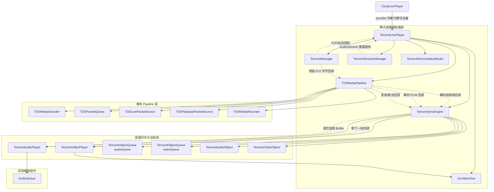
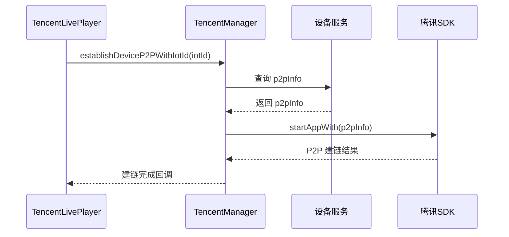
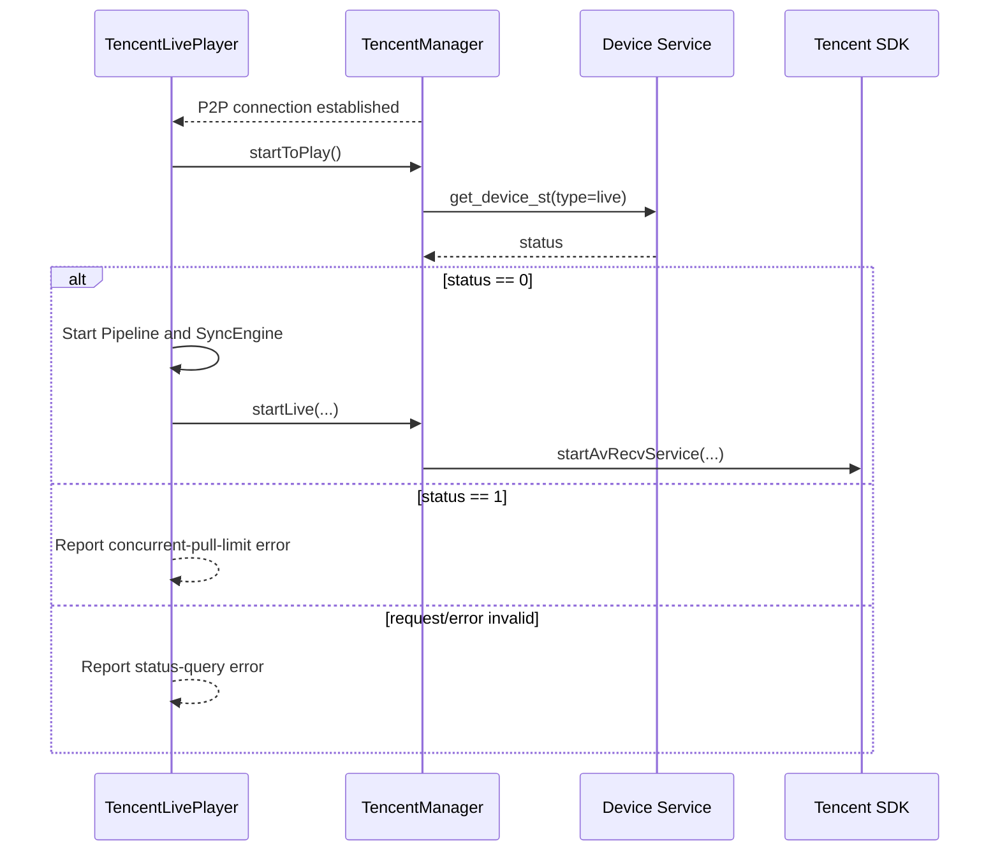
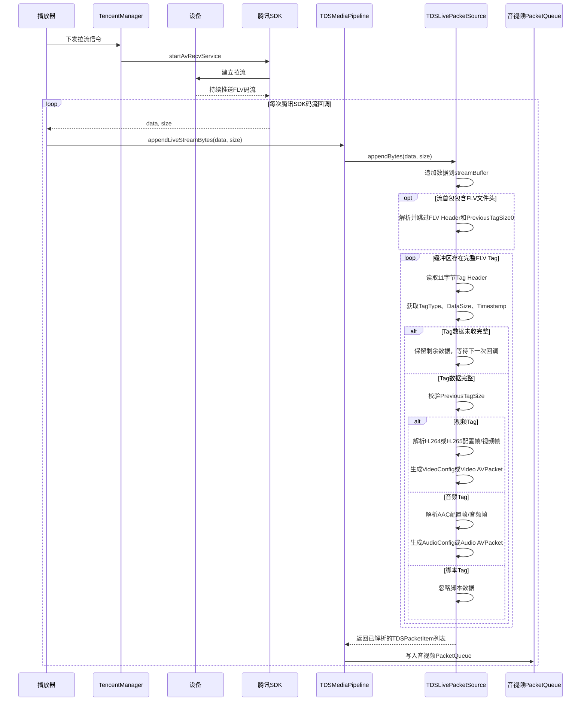
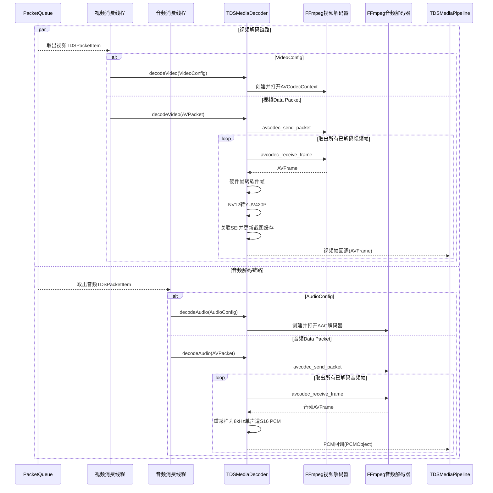

# 安防腾讯设备直播流程解析
#### 类依赖关系


#### 类的职责
##### 外层播放器
`CloudLivePlayer`：统一对外提供直播播放接口，根据设备厂商选择阿里或腾讯播放器。
`TencentLivePlayer`：腾讯直播业务封装，负责设备连接、拉流控制、播放状态、截图、录制和对外回调。
##### 腾讯业务组件
`TencentManager`：负责腾讯设备 P2P 连接、开始/停止拉流、设备控制和原始 FLV 数据回调。
`TencentSessionManager`：监听和处理音频会话重置、系统音频中断等事件。
`TencentDeviceStatusModel`：解析设备视频状态查询结果，例如是否允许拉流。
##### 媒体 Pipeline
`TDSMediaPipeline`：媒体处理总入口，负责接收数据、管理线程、队列、解码、丢帧、录制和 EOS。
`TDSLivePacketSource`：处理直播 FLV 字节流输入。
`TDSPlaybackPacketSource`：处理本地回放或云存回放的文件/网络输入，直播场景通常不使用。
`TDSPacketQueue`：缓存压缩后的音视频 packet，并负责按媒体类型出队、限流和丢帧。
`TDSMediaDecoder`：调用 FFmpeg 解码视频帧和 PCM 音频。
`TDSMediaRecorder`：将收到的媒体数据写入录像文件。
音视频同步与渲染
`TencentSyncEngine`：管理解码后的音视频队列、音频时钟、视频 PTS 调度、暂停恢复、seek 和倍速切换。
`TencentObjectQueue`：缓存解码后的音频对象和视频对象。
`TencentAudioObject`：封装一段 PCM 音频数据及其 PTS、时长。
`TencentVideoObject`：封装一帧 AVFrame 及其 PTS、时长。
`TencentAudioPlayer`：管理 AudioQueue，向系统音频缓冲区填充 PCM，并更新音频时钟。
`TencentVideoPlayer`：管理视频渲染定时器，根据 PTS 触发下一帧渲染。
`GLVideoView`：执行 OpenGL 视频渲染、超分渲染、截图和视频录制。

#### 直播流程
- 初始化`CloudLivePlayer`
```objc
- (CloudLivePlayer *)player{
    if (!_player) {
        // 根据 iotId、channel、provider 来初始化 player
        _player = [[CloudLivePlayer alloc] initWithIotId:_model.iotId p2pInfo:_model.p2pInfo channel:@"0" provider:_model.provider];
        // 设置代理
        _player.delegate = self;
        BOOL iSEIOpen = [TDSAppUserDefaults isTargetFrameEnabled];
        // 设置是否渲染智能框
        [_player setRenderSEIBox:iSEIOpen];
    }
    return _player;
}

// 设置渲染窗口，类型为GLVideoView
[self.player setWindow:self.liveVideoView videoRotationMode:CloudPlayerRotationMode_0_CLOCKWISE];
// 设置码流清晰度
[self.player setStreamType:streamType];
// 设置超分开关
[self.player setSuperResolutionEnabled:[self supportResolution:streamType]];
// 开始拉流
[self.player start];
```

- 初始化`TencentLivePlayer`
`CloudLivePlayer`内部会根据传入的 `provider` 来决定初始化`AliLivePlayer`或`TencentLivePlayer`
`provider` 值为 `C` 时，初始化`TencentLivePlayer`
```objc
/// 判断播放器类型
- (CloudLivePlayerType)determinePlayerType {
    if ([_provider isTencentDevice]) {
        return CloudLivePlayerTypeTencent;
    }
    return CloudLivePlayerTypeAli;
}

/// 初始化播放器
- (void)initialPlayer {
    if (_playerType == CloudLivePlayerTypeAli) {
        _aliPlayer = [[AliLivePlayer alloc] initWithIotId:_iotId];
        _aliPlayer.delegate = self;
    } else {
        _tcPlayer = [[TencentLivePlayer alloc] initWithIotId:_iotId p2pInfo:_p2pInfo channel:_channel];
        _tcPlayer.delegate = self;
    }
}
```
```objc
@implementation NSString (Provider)

- (BOOL)isTencentDevice {
    return [self isEqualToString:@"C"];
}

@end
```
- 建立 `P2P` 链接
在调用 `start` 方法后，会在 `TencentLivePlayer` 内部去建立 `P2P` 链接
```objc
TencentLivePlayer
    触发建链请求
        ↓
TencentManager
    查询 p2pInfo，并编排建链流程
        ↓
腾讯 SDK
    执行实际的 P2P 建链
```
*具体流程：*
1. TencentLivePlayer 调用 TencentManager 的 establishDeviceP2PWithIotId。
2. TencentManager 查询设备的 p2pInfo。
3. 获取 p2pInfo 后，调用腾讯 SDK 的 startAppWith 建立 P2P 连接。
4. 建链结果通过异步回调返回 TencentLivePlayer。
5. 建链成功后调用 startToPlay 开始拉流；建链失败则回调错误。

*关键代码：*
```objc
[[TencentManager shared]
    establishDeviceP2PWithIotId:_iotId
    completeBlock:^(BOOL success) {
        TencentLivePlayer *player = weakSelf;
        if (!player) {
            return;
        }

        // 建链期间如果用户已经停止播放，则忽略本次建链结果。
        if (!player.startFlag) {
            [player stop];
            return;
        }

        if (success) {
            [player startToPlay];
        } else {
            NSError *error = ...;
            [player showError:error];
        }
    }];
```
*时序图：*


- 拉流
在建立好P2P 链接之后，就可以向设备发送信令
首先会向设备发送查询是否可拉流的信令
在设备返回可拉流的状态后，下发拉流信令
```objc
[[TencentManager shared] queryDeviceVideoStatus:_iotId type:@"live" quality:_streamTypeStr channel:@"0" complete:^(NSDictionary *resp, NSError *error) {
        __strong TencentLivePlayer *self = weakSelf;
        // 此处为异步，所以需要判定self是否还存在
        if (!self) {
            return;
        }
        // 此处为异步，所以需要考虑在回调回来之后，是否调用过 stop，如果调用过 stop 就不再去拉流
        if (!self.startFlag) {
            [self stop];
            return;
        }
        TencentDeviceStatusModel *responseModel = [TencentDeviceStatusModel modelWithJSON:resp];
        if ([responseModel.status isEqualToString:@"0"]) {
            DDLogInfo(@"Live Within Stream viewer limit");
            // 可拉流
            if (!self->_mediaPipeline->start()) {
                DDLogError(@"TencentLivePlayer media pipeline start failed, iotId=%@", self.iotId);
            }
            [self setFFmpegCallBackWithIotId:self.iotId];
            [self.syncEngine start];
            // 拉流
            [[TencentManager shared] startLiveWithIotId:self.iotId excuteStr:self.excuteStr livePlayer:self];
        } else if ([responseModel.status isEqualToString:@"1"]) {
            DDLogInfo(@"Live Stream viewer limit exceeded");
            // 不可拉流
            // 更新播放器状态为播放结束
            [self onChangePlayerState:CloudPlayerStateENDED];
            [self onLivePlayerError:[NSError errorWithDomain:@"p2p.error" code:CloudPlayerErrorCodeStatusInvalid userInfo:@{@"endReason" : @(CloudPlayerErrorSubcodeStatusMoreThanLimited)}]];
        } else {
            DDLogInfo(@"Live get_device_st resp is nil");
            NSError *error = [NSError errorWithDomain:@"p2p.error" code:CloudPlayerErrorCodeStatusInvalid userInfo:@{@"endReason" : @(CloudPlayerErrorSubcodeStatusOthers)}];
            [self showError:error];
        }
    }];
```
*时序图：*


- 拆分 FLV 码流
拉流信令下发成功后，设备会持续推送 FLV 码流，腾讯 SDK 通过回调将任意长度的码流分片返回。播放器收到数据后调用 TDSMediaPipeline::appendLiveStreamBytes，再由 TDSLivePacketSource 将分片追加到内部缓冲区。  
TDSLivePacketSource 会先识别并跳过 FLV 文件头，然后循环解析完整的 FLV Tag：读取 11 字节 Tag Header，获取 Tag 类型、数据长度和时间戳；根据 DataSize 判断当前缓冲区是否已包含完整 Tag。若数据不足，则保留未完成部分，等待下一次回调继续拼接；若数据完整，则校验 Tag 尾部的 PreviousTagSize，并按 Tag 类型分别处理。  
视频 Tag 会解析 H.264/H.265 的配置帧或视频数据帧，音频 Tag 会解析 AAC 的配置帧或音频数据帧，脚本 Tag 则直接忽略。完整的音视频 Tag 最终被转换为 FFmpeg 可识别的 AVPacket，封装为 TDSPacketItem 后送入 Pipeline 的音视频 PacketQueue，由后续解码线程分别消费。

*关键代码：*
```objc
    bool TDSLivePacketSource::appendBytes(const uint8_t* data,
                                      size_t size,
                                      std::vector<TDSPacketItem>& items) {
    items.clear();
    if (!data || size == 0 || size > kMaxFLVTagSize ||
        streamBuffer_.size() > kMaxFLVTagSize - size) {
        return false;
    }
    streamBuffer_.insert(streamBuffer_.end(), data, data + size);

    if (streamBuffer_.size() >= kFLVHeaderSize &&
        streamBuffer_[0] == 'F' && streamBuffer_[1] == 'L' && streamBuffer_[2] == 'V') {
        const uint32_t dataOffset = readBE32(streamBuffer_.data() + 5);
        const size_t totalHeaderSize = static_cast<size_t>(dataOffset) + kFLVPreviousTagSize;
        if (dataOffset < kFLVHeaderSize || totalHeaderSize > kMaxFLVTagSize) {
            reset();
            return false;
        }
        if (streamBuffer_.size() < totalHeaderSize) {
            return true;
        }
        streamBuffer_.erase(streamBuffer_.begin(), streamBuffer_.begin() + totalHeaderSize);
    }

    while (streamBuffer_.size() >= kFLVTagHeaderSize) {
        const uint8_t tagType = streamBuffer_[0];
        if (tagType != kFLVAudioTag && tagType != kFLVVideoTag && tagType != kFLVScriptTag) {
            reset();
            return false;
        }
        const uint32_t bodySize = readBE24(streamBuffer_.data() + 1);
        const size_t fullTagSize = kFLVTagHeaderSize +
                                   static_cast<size_t>(bodySize) +
                                   kFLVPreviousTagSize;
        if (fullTagSize > kMaxFLVTagSize) {
            reset();
            return false;
        }
        if (streamBuffer_.size() < fullTagSize) {
            break;
        }

        TDSPacketItem item;
        const TDSLivePacketParseResult result = convertFLVTag(
            streamBuffer_.data(), fullTagSize, item);
        streamBuffer_.erase(streamBuffer_.begin(), streamBuffer_.begin() + fullTagSize);
        if (result == TDSLivePacketParseResult::Success) {
            items.push_back(std::move(item));
        } else if (result != TDSLivePacketParseResult::IgnoredTag) {
            reset();
            return false;
        }
    }
    return true;
}

TDSLivePacketParseResult TDSLivePacketSource::convertFLVTag(
    const uint8_t* data,
    size_t size,
    TDSPacketItem& item) const {
    item = TDSPacketItem{};
    if (!data || size < kFLVTagHeaderSize + kFLVPreviousTagSize) {
        return TDSLivePacketParseResult::InvalidTag;
    }

    const uint32_t bodySize = readBE24(data + 1);
    const size_t expectedSize = kFLVTagHeaderSize +
                                static_cast<size_t>(bodySize) +
                                kFLVPreviousTagSize;
    if (size != expectedSize) {
        return TDSLivePacketParseResult::InvalidTag;
    }

    const uint32_t previousTagSize = readBE32(data + kFLVTagHeaderSize + bodySize);
    if (previousTagSize != kFLVTagHeaderSize + bodySize) {
        return TDSLivePacketParseResult::InvalidTag;
    }

    const uint32_t timestampMs = readFLVTimestamp(data);
    const uint8_t* body = data + kFLVTagHeaderSize;
    switch (data[0]) {
        case kFLVVideoTag:
            return convertVideoTag(body, bodySize, timestampMs, item);
        case kFLVAudioTag:
            return convertAudioTag(body, bodySize, timestampMs, item);
        case kFLVScriptTag:
            return TDSLivePacketParseResult::IgnoredTag;
        default:
            return TDSLivePacketParseResult::InvalidTag;
    }
}
```

*时序图：*


- 音视频解码
PacketQueue 中的音视频数据由两个独立的消费线程处理，视频线程只取视频 Packet，音频线程只取音频 Packet。
视频线程取到 VideoConfig 后先初始化 FFmpeg 视频解码器；取到视频数据后调用 avcodec_send_packet 将 AVPacket 送入解码器，再通过 avcodec_receive_frame 持续取出解码完成的 AVFrame。如果使用 VideoToolbox 解码，先将硬件帧转换为软件帧；NV12 帧再统一转换为 YUV420P。随后，解码器会关联 SEI 信息、更新截图缓存，并通过视频帧回调把 AVFrame 交给 TDSMediaPipeline。

- 音视频渲染
Pipeline 再通过已注册的回调把视频帧交给 [TencentLivePlayer.mm (line 603)](/Users/apple/Desktop/SDK/platform/ios/TestSDK/TestAliSDK/Internal/ImplManager/Tencent/TencentLivePlayer.mm:603) 中的 TencentSyncEngine::appendVideoData:。SyncEngine 将帧包装为 TencentVideoObject 放入视频队列；视频队列具备数据后，渲染器按 PTS 调度并渲染下一帧。实际渲染完成后，SyncEngine 回传当前渲染 PTS，并在主线程通知播放器进入 READY 状态。
音频线程的过程类似：先由 AudioConfig 初始化 AAC 解码器，随后 avcodec_send_packet / avcodec_receive_frame 取出音频帧。解码器会把输出统一转换为 8 kHz、单声道、S16 PCM，封装为 PCMObject，再经 Pipeline 的 PCM 回调送到 [TencentLivePlayer.mm (line 614)](/Users/apple/Desktop/SDK/platform/ios/TestSDK/TestAliSDK/Internal/ImplManager/Tencent/TencentLivePlayer.mm:614)。SyncEngine 将 PCM 封装为 TencentAudioObject 放入音频队列，交由音频播放器输出。
其中，解码完成后的帧回调运行在 Pipeline 的音视频解码线程，不在主线程；只有最终的播放器状态和渲染 PTS 通知会切回主线程。


