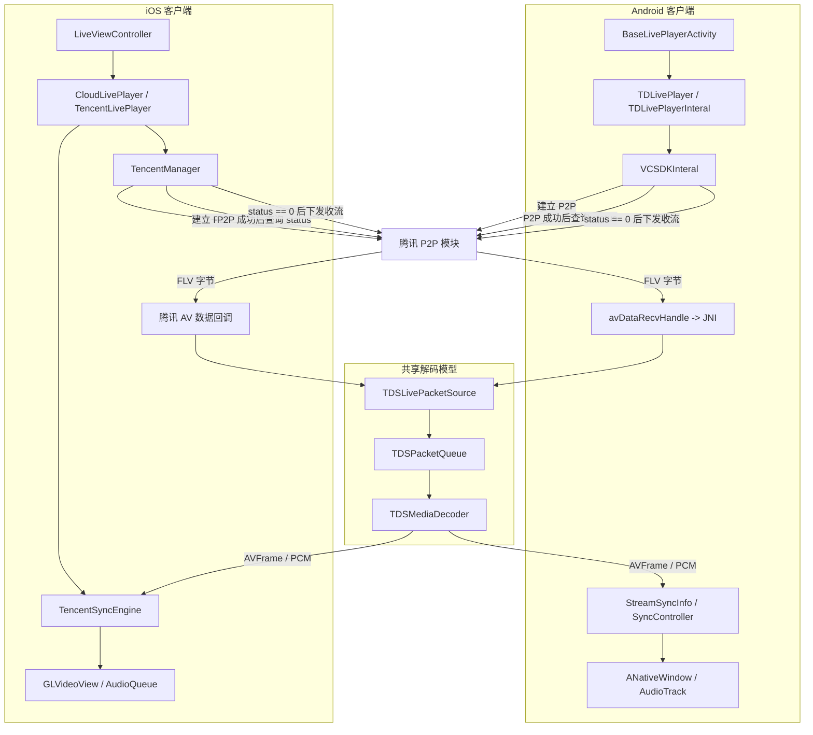
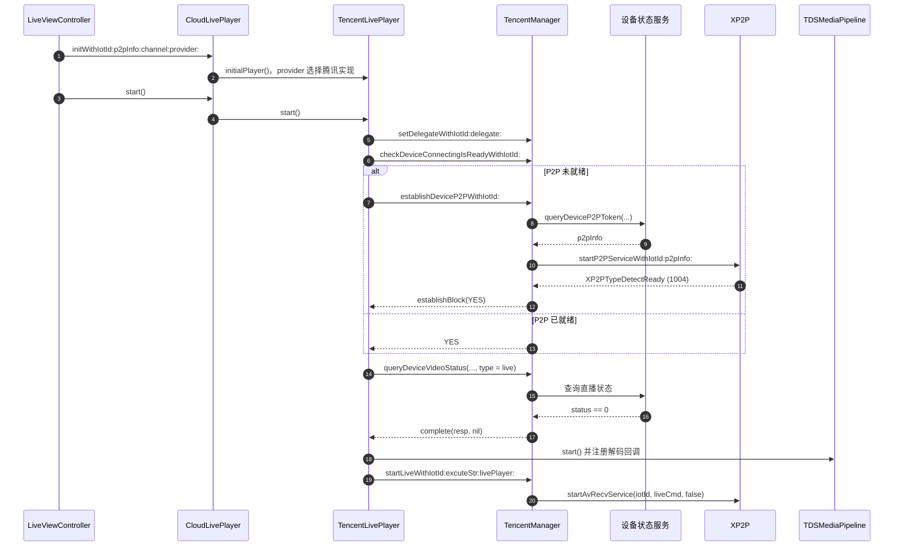
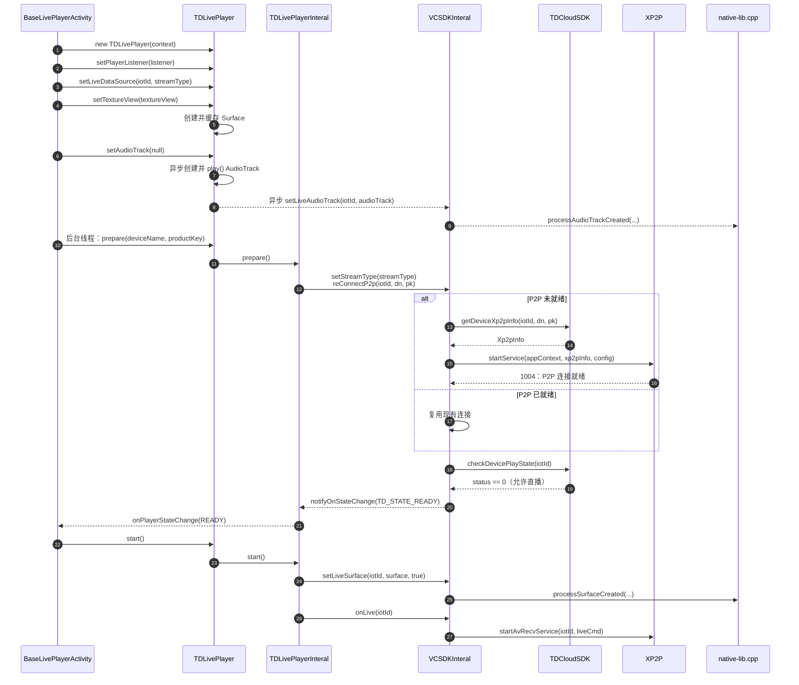
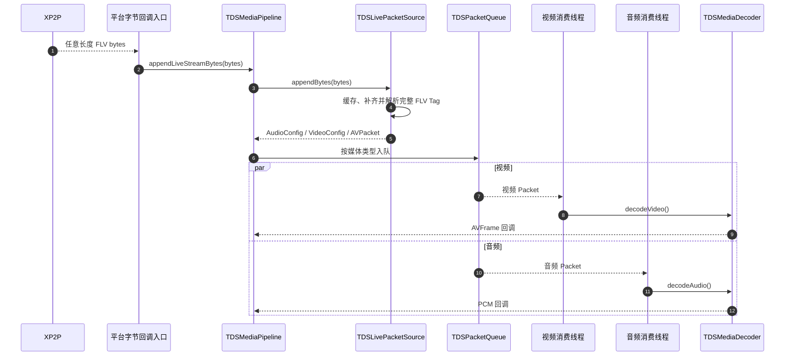

# 安防腾讯设备跨端直播流程解析：Android 与 iOS

> 本文面向需要理解 Android/iOS 架构差异、并能沿关键函数定位和修改实现的 SDK 开发者。
>
> 范围仅限腾讯设备的实时直播播放：从播放器初始化、P2P 建连、播放许可、收流、解码、同步和输出，到停止释放。回放、录像、截图、超分、SEI 智能框不在本文讨论范围内。

## 1. 阅读结论

两端的直播链路按播放器实际工作划分为三个阶段：

- **拉流**：建立 P2P、确认 `status == 0`、下发 `startAvRecvService()`，并接收原始 FLV 字节。
- **解码**：缓存和解析 FLV 分片、写入 PacketQueue、由音视频消费线程解码为 `AVFrame` 与 PCM。
- **渲染**：准备视频、音频输出目标，将解码后的音视频按时钟同步，输出到系统视频窗口和音频设备。

两端在解码阶段共享 `TDSMediaPipeline`、`TDSLivePacketSource`、`TDSPacketQueue` 和 `TDSMediaDecoder` 所描述的处理模型。平台差异主要发生在拉流时机和渲染输出层：

- Android 使用 `StreamSyncInfo` 管理单路 Native 会话，通过 `SyncController` 调度视频，输出到 `ANativeWindow` 和 `AudioTrack`。
- iOS 使用 `TencentSyncEngine` 管理解码后的音视频对象队列，输出到 `GLVideoView` 和 `AudioQueue`。

三个阶段按职责划分，并非要求代码严格按三段顺序执行。例如 `setTextureView()`、`setWindow:` 等渲染目标准备会先于首个 FLV 字节到达，但它们仍属于渲染层的准备工作。

最容易混淆的是 `READY`：Android 的 `TD_STATE_READY` 表示 P2P 和设备播放许可已经满足，页面随后才会调用 `start()`；iOS 当前的 `CloudPlayerStateREADY` 在首帧渲染完成后通知。二者不能视为同一个跨端状态。

## 2. 统一术语与状态映射

为避免直接以不同平台的枚举名讨论，本文使用下列跨端阶段名。

| 跨端阶段 | 含义 | Android 当前实现 | iOS 当前实现 |
| --- | --- | --- | --- |
| `OutputBound` | 已绑定可用的视频、音频输出目标 | `setTextureView()`、`setAudioTrack()` | `setWindow:` 绑定 `GLVideoView` |
| `P2PConnected` | 底层 P2P 连接已建立 | XP2P 事件 `1004` | P2P connection established |
| `StreamPermitted` | 云端/设备确认允许本次直播 | `checkDevicePlayState(..., "live")` 返回 `status == 0`，通知 `TD_STATE_READY` | `queryDeviceVideoStatus` 返回 `status == 0` |
| `PullStarted` | 已向设备下发实时音视频收流命令 | `startAvRecvService()` | `startAvRecvService()` |
| `FirstFrameRendered` | 已真实输出首个视频帧 | `onFirstFrameRendered()` | `CloudPlayerStateREADY` |
| `Stopped` | 收流、媒体线程和平台资源均已停止 | `stopLive/releaseLive` 后释放 Native 会话 | 停止收流、Pipeline、SyncEngine 和平台输出 |

`P2PConnected` 只说明链路建立，不能据此断定可以收流。`StreamPermitted` 才表示设备状态允许播放；`FirstFrameRendered` 则是用户真正看到画面的时刻。

## 3. 总体架构：拉流、解码与渲染



本文后续章节依次回答三个问题：流是如何开始并进入播放器的、字节如何被解码、解码后的音视频如何显示和播放。

## 4. 拉流：初始化、P2P 建连、播放许可与收流启动

### 4.1 拉流阶段的共同目标

拉流阶段的目标是使设备持续向播放器交付原始 FLV 字节。它按顺序完成以下条件：

```text
输出目标已准备
  -> P2P 已连接
  -> status == 0，设备允许直播
  -> 启动媒体会话和收流
```

P2P 事件 `1004` 与 `status == 0` 缺一不可。前者是连接状态，后者是业务播放许可。

### 4.2 Android：`prepare()` 到页面 `start()`

Android 页面创建 `TDLivePlayer` 后，先设置监听器、数据源、`TextureView` 和 `AudioTrack`。`setTextureView()` 只从 `SurfaceTexture` 创建并保存 Java `Surface`；`setAudioTrack()` 异步准备 `AudioTrack`，成功后会调用 `play()` 并绑定给 SDK。

真正的 P2P 建连从 `prepare()` 开始：

```text
BaseLivePlayerActivity
  -> TDLivePlayer.prepare()
  -> TDLivePlayerInteral.reConnectP2p()
  -> VCSDKInteral.refreshDeviceXp2pInfo()
  -> TDCloudSDK.getDeviceXp2pInfo()
  -> XP2P.startService()
  -> 1004
  -> checkDevicePlayState(..., "live")
  -> status == 0
  -> notifyOnStateChange(TD_STATE_READY)
  -> BaseLivePlayerActivity.onPlayerStateChange()
  -> TDLivePlayer.start()
```


`start()` 随后完成 Java 输出对象到 Native 会话的绑定，再调用 `onLive()`，最终由 XP2P 执行 `startAvRecvService()`。

### 4.3 iOS：`start` 内部完成许可检查和收流

iOS 页面配置 `CloudLivePlayer`：它根据 `provider` 选择 `TencentLivePlayer`，并绑定 `GLVideoView`、清晰度和代理。播放器启动后，由 `TencentManager` 驱动 P2P 建连和设备状态查询：

```text
LiveViewController
  -> CloudLivePlayer.start()
  -> TencentLivePlayer
  -> TencentManager.establishDeviceP2PWithIotId()
  -> queryDeviceP2PToken:provider:complete:
  -> startP2PServiceWithIotId(..., p2pInfo)
  -> 1004
  -> queryDeviceVideoStatus(type=live)
  -> status == 0
  -> TDSMediaPipeline.start()
  -> TencentSyncEngine.start()
  -> TencentManager.startLive()
  -> XP2P.startAvRecvService()
```

iOS 先由 `TencentManager` 调用 `queryDeviceP2PToken:provider:complete:` 获取 `p2pInfo`，再调用腾讯 SDK 建立 P2P；收到 `1004` 后，`TencentLivePlayer` 才查询直播状态。`StreamPermitted` 之后的媒体管线启动和收流仍封装在播放器内部；业务页面没有 Android 那样“收到 `READY` 后再显式 `start()`”的二次启动步骤。

### 4.4 拉流时序对照

#### iOS


#### Android


### 4.5 拉流代码导航

| 职责 | Android | iOS |
| --- | --- | --- |
| 业务页面入口 | `BaseLivePlayerActivity` | `LiveViewController` |
| 对外播放器 | `TDLivePlayer` | `CloudLivePlayer` |
| 腾讯播放器实现 | `TDLivePlayerInteral`、`VCSDKInteral` | `TencentLivePlayer`、`TencentManager` |
| P2P 建连 | `VCSDKInteral.reConnectP2p()` | `establishDeviceP2PWithIotId:completeBlock:` |
| 播放许可 | `checkDevicePlayState(..., "live")` | `queryDeviceVideoStatus:type:quality:channel:complete:` |
| 收流入口 | `onLive()` -> `startAvRecvService()` | `startLive()` -> `startAvRecvService()` |

## 5. 解码：FLV 分片到音视频帧

`startAvRecvService()` 成功后，设备连续发送任意长度的 FLV 字节分片。一个 FLV Tag 可能被拆在多个回调中，媒体层必须缓存不完整数据，不能按单次回调直接解码。




1. 平台 P2P 回调将原始字节交给 `TDSMediaPipeline::appendLiveStreamBytes`。
2. `TDSLivePacketSource` 保存残缺分片，跳过 FLV Header，只有 Tag Header、Payload 和 `PreviousTagSize` 完整时才解析。
3. 视频/音频配置包和数据包被包装为 `TDSPacketItem`，写入对应 `TDSPacketQueue`。
4. Pipeline 根据缓冲策略打开初始解码门；视频和音频消费线程分别取队列，避免同一线程串行解码造成相互阻塞。
5. `TDSMediaDecoder` 通过 FFmpeg 输出视频 `AVFrame` 与转换为目标格式的 PCM，再经 Pipeline 注册的回调交给平台输出层；仅当输入音频参数与目标输出不兼容时，才使用重采样作为兜底。

## 6. 渲染：同步、视频显示与音频输出

### 6.1 Android：`StreamSyncInfo` 与 `SyncController`

Android 的 JNI 层以播放类型和 `iotId` 从 Native 注册表取得或创建 `StreamSyncInfo`。它是**单路直播会话**，持有窗口、音频引用、`TDSMediaPipeline`、帧/PCM 缓存以及相关工作线程。

`setLiveSurface()` 进入 JNI 后，将 Java `Surface` 绑定为 `ANativeWindow`；`setLiveAudioTrack()` 则保存 `AudioTrack` 的 JNI 全局引用。这样持续运行的 Native 渲染、音频线程不依赖某次 Java 调用栈。

视频路径：

```text
VideoFrameCallback(AVFrame)
  -> StreamSyncInfo.renderVideoCallback()
  -> SyncController.pushAVFrame()
  -> FrameQueue
  -> getNextFrame(frame, waitMs)
  -> 正常渲染 / 等待过早帧 / 丢弃落后帧
  -> ANativeWindow lock -> 颜色转换和复制 -> unlockAndPost
  -> TextureView
```

音频路径：

```text
PCMCallback
  -> StreamSyncInfo 的 PCM 缓存
  -> Native 音频线程
  -> AudioTrack.write()
  -> SyncController.commitAudioClock()
```

视频以音频时钟为主参考。`getNextFrame()` 返回的决策决定当前帧立即渲染、等待，或因已落后而丢弃；这也是直播卡顿、音画不同步排查的关键入口。

### 6.2 iOS：`TencentSyncEngine` 与系统输出

iOS 的视频帧、PCM 回调先回到 `TencentLivePlayer`，再交给 `TencentSyncEngine`：

```text
AVFrame -> TencentVideoObject -> videoQueue -> TencentVideoPlayer -> GLVideoView
PCM     -> TencentAudioObject -> audioQueue -> TencentAudioPlayer -> AudioQueue
```

`TencentSyncEngine` 管理解码后的对象队列、音频时钟和视频 PTS 调度。视频渲染完成后返回 `renderedPts`，播放器在主线程处理状态通知；音频播放器按系统 `AudioQueue` 的 buffer 请求持续填充 PCM。

### 6.3 输出层差异与首帧回调

| 维度 | Android | iOS |
| --- | --- | --- |
| 单路会话对象 | `StreamSyncInfo` | `TencentSyncEngine` |
| 视频队列与调度 | `SyncController` / `FrameQueue` | `TencentObjectQueue` / PTS 调度 |
| 视频输出 | `ANativeWindow`，最终显示在 `TextureView` | `GLVideoView` |
| 音频输出 | `AudioTrack.write()` | `AudioQueue` buffer 填充 |
| 首帧语义 | `onFirstFrameRendered()` 独立上报 | 当前实现中进入 `CloudPlayerStateREADY` |

因此业务层如果需要跨端统一“已经看到画面”的体验指标，应订阅或映射到 `FirstFrameRendered`，不要直接比较两端的 `READY` 枚举。

## 7. 停止、释放与重连

停止流程必须覆盖拉流、解码和渲染三个阶段；只停止 P2P 收流不足以释放已运行的解码、渲染和音频资源。

Android 的关键顺序为：

```text
TDLivePlayer.stop()
  -> VCSDKInteral.stopLive(iotId)
  -> XP2P.stopAvRecvService(iotId)
  -> JNI.processStopLive(iotId)
  -> 停止 SyncController、渲染线程、音频线程、TDSMediaPipeline
  -> VCSDKInteral.releaseLive(iotId)
  -> JNI.processReleaseLive(iotId)
  -> Native 注册表 erase(type, iotId)
```

`StreamSyncInfo` 的生命周期由 Native 注册表显式结束，不会因为 Java `TDLivePlayer` 失去引用而自动终结。`release()` 漏调会残留窗口、JNI 全局引用、线程和解码资源。

iOS 的停止路径也必须以相同的资源层次收束：先禁止新的 P2P 数据进入，再停止 Pipeline 消费线程与 `TencentSyncEngine`，最后释放视频、音频系统输出和播放器持有对象。修改 iOS 停止逻辑时，应验证停止后回调不再向已经释放的同步引擎入队。

重连时必须区分“P2P 需要重建”和“原媒体会话仍可复用”。Android 的 `reConnectP2p()` 在已有 `DETECT_READY` 状态时先停服务，避免在就绪连接上重复启动；未处于连接中或就绪状态时才刷新 XP2P 信息。

## 8. 关键代码索引

| 目标 | Android 代码入口 | iOS 代码入口 |
| --- | --- | --- |
| 直播页面开始播放 | `BaseLivePlayerActivity` 的 `onPlayerStateChange(...)` | `LiveViewController` 的 `CloudLivePlayer.start()` 调用点 |
| P2P 建连/重连 | `VCSDKInteral.reConnectP2p(...)` | `TencentManager.establishDeviceP2PWithIotId:completeBlock:` |
| 播放许可 | `checkDevicePlayState(...)` | `queryDeviceVideoStatus:...complete:` |
| 启动收流 | `VCSDKInteral.onLive(...)` | `TencentManager.startLive(...)` |
| 原始数据进入媒体层 | `avDataRecvHandle(...)` -> `processAvDataInJni(...)` | 腾讯数据回调 -> `appendLiveStreamBytes` |
| 创建 Android Native 会话 | `native-lib.cpp` 的 `processSurfaceCreated(...)` | 不适用 |
| 绑定视频/音频输出 | `processSurfaceCreated(...)`、`processAudioTrackCreated(...)` | `setWindow:`、`TencentSyncEngine` 输出配置 |
| 解码后视频入口 | `StreamSyncInfo.renderVideoCallback(...)` | `TencentLivePlayer appendVideoData:` |
| 解码后音频入口 | `StreamSyncInfo.renderAudioFrame(...)` | `TencentLivePlayer appendAudioData:...` |
| 停止与释放 | `processStopLive(...)`、`processReleaseLive(...)` | `TencentLivePlayer` 的停止与资源释放流程 |

可配合以下现有文档查看更细实现：

- `安防腾讯设备 Andriod 端直播流程解析.md`
- `安防腾讯设备 iOS 端直播流程解析.md`
